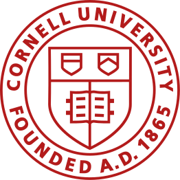

```{=html}
<div class="aem-hero">
  <p class="hero-number">AEM 6991</p>
  <p class="hero-title">MPS Capstone Project I</p>
  <p class="hero-instructors">Taught by
    <a href="https://arielortizbobea.github.io">Prof.&nbsp;Ariel Ortiz-Bobea</a></p>
  <div class="hero-meta">
    Fall 2026 · Wednesdays 2:00 to 4:30 pm · Riley-Robb Hall B15<br>
    Office hours: TBA in week 1, posted on Canvas
  </div>
</div>

<div class="hero-brand">
  
</div>

<div class="hero-summary">
  <p>
  This is a core course for Master of Professional Studies (MPS) in Applied
  Economics and Management. It provides students with the opportunity to
  explore strategies for behavioral, quantitative, and qualitative
  problem-solving projects. We consider the conceptual challenges associated
  with identifying and defining a project topic and examine the practical
  tasks of selecting or collecting data, analyzing data, and reporting the
  results, including visualization and writing. The objective of the course is
  for students to understand how problems associated with different kinds of
  projects can be addressed with empirical methods. Many course activities
  will be structured as teamwork, and team leadership and management skills
  are a major component of the course. The course topics are introduced
  through readings, class discussion, and independent team-based research.
  </p>
</div>
```


