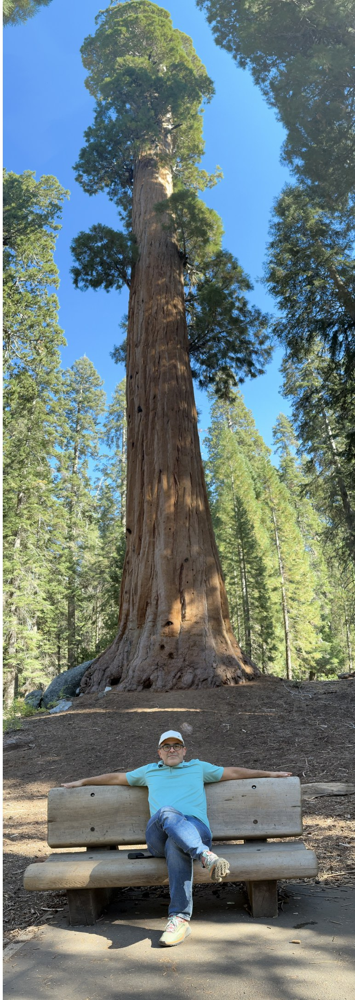

:::: {.content-hidden when-format="revealjs"}

[Slides](01-introductions-slides.html)

## Due before meeting 2 · September 2

**Statement of interest**, one to two pages. What you might want to work
on, why it matters, what you want out of it professionally, and what you
bring to it that most people here do not. Teams are formed from these.

::::

:::: {.content-visible when-format="revealjs"}

# Introductions

## About me {.smaller}

:::: {.columns}

::: {.column width="64%"}
- Ariel Ortiz-Bobea. Dyson School and the Brooks School of Public
  Policy. At Cornell since 2014.
- Before Cornell: Resources for the Future; PhD, University of Maryland;
  Ministry of the Environment of the Dominican Republic.
- Research: how people cope with environmental change — especially what
  climate change does to the economy, and to agriculture in particular.
  More at [arielortizbobea.github.io](https://arielortizbobea.github.io).

Office 450B Warren · [ao332@cornell.edu](mailto:ao332@cornell.edu)
:::

::: {.column width="32%"}
{fig-align="center" height="420"}
:::

::::

::: {.notes}
Three minutes. Then one concrete result of your own and what its
identification problem was — that is the thing they will be doing all
term, and it is worth more than the CV.
:::

## Now you {.smaller}

Four things, briefly:

1. Your name, and where you are from
2. What you studied or did before this — training, or work
3. Your concentration
4. What you want out of this program, and after it

::: {.notes}
Go round the room. Twenty-five students at about thirty seconds each is
thirteen minutes, and it is the most expensive item in session A — but
it is how the room learns who it is, and they hear each other's
interests before teams get formed next week.

Keep it moving. If someone runs long on item 4, that is the one to let
breathe; items 1–3 are the ones to cut.

Write down anything that sounds like a real question rather than a
topic. You form teams from the statements of interest next week, and
this is your first signal.
:::

# The course

## Two courses, one project {.smaller}

AEM 6991 (fall). You produce a *plan* — a question, a design, and
evidence that the data exists.

AEM 6992 (spring). You *execute* that plan.

The deliverable in December is a proposal somebody could hand to a team in
January.

::: {.notes}
Everything you commit to in the fall you live with in the spring. A
question that is vague in October is a disaster in March.
:::

## What this course is for {.smaller}

By December you should be able to:

- Find a question worth a semester, and say why it matters
- Design a study that could answer it — and name the assumption
  carrying it
- Prove the data exists, can be obtained, and measures what you need
- Say what you can and cannot claim, and defend that in a room
- Work in a team that delivers on time, with the work split fairly

::: {.notes}
These are the registrar's four outcomes for 6991 plus the two this
section adds — evidence sourcing, and design vocabulary. Do not read
them off. Say the fifth one is graded as hard as the rest, because the
course description calls teamwork a major component and every other
section treats it as goodwill.
:::

## What this is not {.smaller}

You are not writing a paper for a journal.

- No gap in the literature to fill
- No contribution to claim
- Nobody is going to referee this for *AJAE*

::: {.notes}
The single most common misunderstanding. Students hear "research design"
and reach for the genre they have seen in seminars. Kill it here.
:::

## What it is {.smaller}

> You are building the analysis a competent team would need before making a
> decision that costs real money.
>
> The standard for "competent" is the same standard a referee would apply.

Rigor and genre are different axes. The rigor bar does not move. The
genre does.

::: {.notes}
If the design would not survive a referee, it does not survive here. But
the audience is a decision-maker, not a discipline.

This also rescues the literature review from feeling academic: you read to
find out whether your question is already answered, not to find a gap.
:::

## Where you are actually going {.smaller}

MPS AEM, class of 2025:

| Job function | Share | | Industry | Share |
|:--|--:|:--|:--|--:|
| Finance | 40% | | Financial services | 38% |
| Marketing / sales | 21% | | Technology | 22% |
| General management | 15% | | Manufacturing | 11% |
| Consulting | 13% | | Consumer packaged goods | 5% |
| Data / analytics | 6% | | Other | 24% |

Goldman · JPMorgan · Morgan Stanley · Citi · HSBC · Tencent · Alibaba ·
P&G · PwC · KPMG

[Source: Cornell SC Johnson, MPS AEM career outcomes. 82% received offers
within six months.]{style="font-size:0.55em; color:#6b6b6b"}

::: {.callout-note appearance="simple"}
Dyson splits what you need into "sharp skills" — statistical thinking
and data analytics — and ["smart skills"](https://business.cornell.edu/dyson/grand-challenges/):
communication, teamwork, project management, leadership.

[GMAC asked 1,100 recruiters](https://www.gmac.com/market-intelligence-and-research/market-research/corporate-recruiters-survey/the-corporate-recruiters-survey-2026-report)
what they value in business graduates in 2026. Communication first.
Problem-solving second.
:::

::: {.notes}
Essentially none of these are research jobs. That is the argument for the
framing on the previous slide — not my taste, the placement data.

The callout is the argument for how this course is weighted. Half the
grade is a team artifact and participation is 20%, because the two things
employers rank first are the two things a solo written exam cannot test.

Data analysis and interpretation came fourth in the same GMAC survey, up
from tenth in one year. Worth saying if you have the time.
:::

## Where everything lives {.smaller}

::: {style="text-align:center; font-size:1.25em"}
arielortizbobea.github.io/aem6991
:::

- Every meeting has a page — what session A covers, what session B
  makes you do, and what is due
- The syllabus is there in full, and it is the contract
- Handouts, resources and worked examples, all permanent

Canvas carries grades and submissions. Everything else is on the
site.

::: {.notes}
Put it on the projector for thirty seconds. Open meeting 1's page, show
that the slides and the manual are the same material, and show the
schedule. Then close it.

Say the one thing that matters: nothing is handed out on paper that is
not also there, so a missed meeting is recoverable.
:::

## What you hand in, and when {.smaller}

| | | |
|:--|:--|:--|
| Sep 2 | Statement of interest | individual |
| Sep 2 | Your team's ground rules | team |
| Sep 30 | Project pitch — 1 page, presented · rate your teammates | team |
| Nov 11 | Proposal outline · rate your teammates | team |
| Nov 18 | Midterm, in class | individual |
| Dec 2 | Final presentation | team |
| Dec 11 | Research proposal, ~5 pages | team |

::: {.notes}
Three team milestones and one exam. That is the spine — say it that way
rather than reading the table.

The pitch is one page and five minutes. The outline is where the whole
argument gets fixed. The proposal is that outline written out.

Nov 18 is fixed and will not move. Dec 11 is to be confirmed.
:::

## How you are graded {.smaller}

Half individual, half team.

| | | | | |
|:--|--:|:--|:--|--:|
| Quizzes | 15% | | Project pitch | 5% |
| Midterm | 15% | | Proposal outline | 15% |
| Participation | 20% | | Research proposal | 30% |

::: {.notes}
Do not read the table. Say the two things that matter: half of it is yours
alone, and the team half is one paper reached in three steps.

Participation starts at full marks and you lose them — a missing statement
of interest, an unfiled check-in, a late peer evaluation, arriving late, an
absence without notice. The detail is on the site.

Room is Riley-Robb B15 all semester. TA to be announced.
:::

## What good work looks like {.smaller}

Two questions move a grade more than anything else.

::: {.callout-important appearance="simple"}
Is the claim in the first sentence?

And could it come out the other way?
:::

Your proposal is graded against the headings it has to answer. They are on
the site, and we come back to them all term.

::: {.notes}
Do not read the thirteen headings out on day one — they have no project
yet and it lands as a wall. Point at the syllabus and move on.

The convention is shared across the 6991 sections: criteria are the
headings a paper must answer, not a points rubric.

Say the thing they will not expect: stating a limitation well EARNS marks.
Hiding one costs them. Most students arrive believing the opposite.
:::

## Quizzes {.smaller}

Short, in class, and without warning. About six across the semester.

- Three questions, three minutes, on your own device
- On the lecture you are sitting in, not on a reading
- Tied to your NetID — it is also the attendance record
- The lowest is dropped, so an honest miss costs nothing

::: {.notes}
Say why they are unannounced: a quiz you can revise for is a reading
check, and a quiz you cannot is a reason to be here and paying
attention. That is the thing worth rewarding.

No quiz today. Say the mechanic and move on.
:::

## AI: permitted, disclosed, verified {.smaller}

Writing the code is no longer the scarce skill. Neither is drafting the
prose. Knowing what to ask for is. So is noticing when the answer is wrong.

From meeting 12 you work with real data through an assistant. What is
graded is the questions you ask and the checks you run, never code you
wrote.

::: {.callout-note appearance="simple"}
McKinsey now runs analyst interviews where you work a problem live on
their AI platform, and they score how you prompt it, how you catch it
being wrong, and how you turn that into a recommendation.
:::

::: {.callout-warning appearance="simple"}
And the other half. In a trial with a thousand students,
[those who used a plain chatbot to practise scored 17% worse](https://www.pnas.org/doi/10.1073/pnas.2422633122)
once it was taken away — worse than students who never had it. Those given
a version that made them work did not.

The midterm is where that shows up.
:::

::: {.notes}
Say plainly that policies differ across sections and that this one is
deliberately permissive. The McKinsey fact IS the reason, so do not rush
it. Employers put "skills using AI tools" FIRST on what they expect to
value in five years, while ranking it 14th today.

The PNAS study is Bastani et al., ~1,000 high-school maths students. Be
accurate about it: the harm came from using it as a crutch during
practice, not from using it at all. The guardrailed version showed no
harm. That distinction IS the policy — permitted, disclosed, verified.

Do NOT bring the grim labour-market version into week 1 — entry-level
postings down 35%, a third of employers already substituting AI. True,
and it will flatten the room. It belongs in meeting 14.
:::

## Break {.smaller}

Back at 3:30.

# Session B · Your interests

## What this hour is for {.smaller}

Teams do not exist yet. I form them from what you tell each other this
afternoon, and from the statement you write this week.

So: get into groups, work out what you would actually like to explore, and
tell the room.

::: {.notes}
Groups of four or five, by proximity — do not spend ten minutes optimising
the grouping. Say out loud that these are NOT the teams, or some of them
will negotiate instead of working.
:::

## In your group {.smaller}

Round the group first. Two minutes each: what you would like to explore,
and why it interests you.

Then brainstorm together. You are looking for things worth a semester.

::: {.callout-note appearance="simple"}
Generate first. Judge later.

Teams that evaluate while brainstorming produce fewer ideas, and safer
ones. Nobody says "that will not work" for the first fifteen minutes.
:::

::: {.notes}
Twelve minutes going round, fifteen brainstorming. Circulate and push on
one thing only: who would act differently if they knew the answer? If
nobody, it is a topic and not yet a question.

Hold the no-judging rule. It is the whole reason this produces more than a
polite conversation.
:::

## Report back {.smaller}

Pick your three best and write them down.

For each one: what you would explore, and who would care about the answer.

Then one person reports them to the room. Two minutes per group.

::: {.notes}
Eight minutes to write, fifteen to report — six groups at about two and a
half minutes.

Write every idea on the board as it comes. The room seeing all of them at
once is the point: overlaps become visible, and that is how people find
each other before the statement of interest is due.

Collect the sheets. They are half of what you form teams from.
:::

## Where to look for data {.smaller}

Before you assume data has to be bought or scraped:

- The Cornell library's licensed holdings — more than most students
  realise, and already paid for
- Dewey, a commercial data marketplace the Johnson College subscribes
  to. You have access at no cost.

Register tonight at [app.deweydata.io](https://app.deweydata.io) with
your Cornell email — approval is a human step, so it takes days.

::: {.notes}
Five minutes at the end, on the projector, from YOUR account — students
will not have access yet.

Teams routinely propose buying data the College already has. Others drop a
good question because they assumed the data was unreachable. Check first.
:::

## Before next week {.smaller}

Statement of interest — one to two pages, due before meeting 2.

- What you might want to work on, and why it matters
- What you want out of it professionally
- What you bring to it that most people here do not

I form the teams from these. Meeting 2 is causal language, and your
team writes down its own ground rules.

::: {.notes}
Say explicitly: "I don't know yet" is useful information, not a failure.
It means the idea is still a topic. Write that down and I will help.
:::

::::

:::: {.content-hidden when-format="revealjs"}

## Session A · 2:05–3:15

### The arc

AEM 6991 produces a *plan*; AEM 6992 *executes* it. The deliverable in
December is a proposal somebody could hand to a team in January.

### AI ground rules

Permitted by default, disclosure mandatory, verification graded. From
meeting 12 you work with real data through an assistant, and what is
graded is the questions you ask and the checks you run — never code you
wrote.

### What this is, and is not

You are not writing a paper for a journal — there is no gap to fill and no
contribution to claim. You are building the analysis a competent team would
need before making a decision that costs real money, and the standard for
"competent" is the same standard a referee would apply. Rigor and genre are
different axes: the rigor bar does not move, the genre does.

This is also why the literature matters without the project being a
literature project. You read to find out whether your question is already
answered, and how people have answered questions like it.

For context, MPS AEM class of 2025: 40% into finance, 21% marketing and
sales, 15% general management, 13% consulting, 6% data and analytics.
Essentially none into research.

## Session B · 3:30–4:30

### What you already have access to

Before assuming data must be bought or scraped: the Cornell library's
licensed holdings, and **Dewey**, a commercial data marketplace the Johnson
College of Business subscribes to and which you can use at no cost. Teams
routinely propose buying data the College already has, or drop a good
question because they assumed the data was unreachable.

**Register at [app.deweydata.io](https://app.deweydata.io) with your
Cornell email**, in week 1. Your account sits pending until an
administrator approves it, so do not leave it until you need the data.

If you are stuck, there is a numbered list of leads under Resources —
[potential project ideas](../project-ideas.qmd). Treat it as a way to
get unstuck, not a menu. Nobody has ever written a good capstone from
somebody else's idea list.

Working backwards from a dataset is legitimate — it is route 5 — provided
you do it honestly: what could this answer, which of those would anybody act
on, and what does it not contain that you would need? The question still has
to survive the filter, and you are still allowed to walk away from the data.
Route 5 done badly is anti-pattern 2.

### Your interests

Teams do not exist yet. They are formed from what you tell each other this
afternoon and from the statement of interest you write this week.

You work in groups of four or five. First round the group, two minutes each:
what you would like to explore, and why it interests you. Then brainstorm
together, looking for things worth a semester. Generate first and judge
later --- teams that evaluate while brainstorming produce fewer ideas, and
safer ones, so nobody says "that will not work" for the first fifteen
minutes.

Then pick your three best. For each, write what you would explore and who
would care about the answer. One person reports them to the room, and every
idea goes on the board, because seeing them all at once is how overlaps
become visible.

These are not the teams.

### Where to look for data

Before assuming data must be bought or scraped: the Cornell library's
licensed holdings, and **Dewey**, a commercial data marketplace the Johnson
College of Business subscribes to and which you can use at no cost. Teams
routinely propose buying data the College already has, or drop a good
question because they assumed the data was unreachable.

**Register at [app.deweydata.io](https://app.deweydata.io) with your
Cornell email**, tonight. Your account sits pending until an administrator
approves it, so do not leave it until you need the data.

Your team's output is submitted before you leave.

::::
