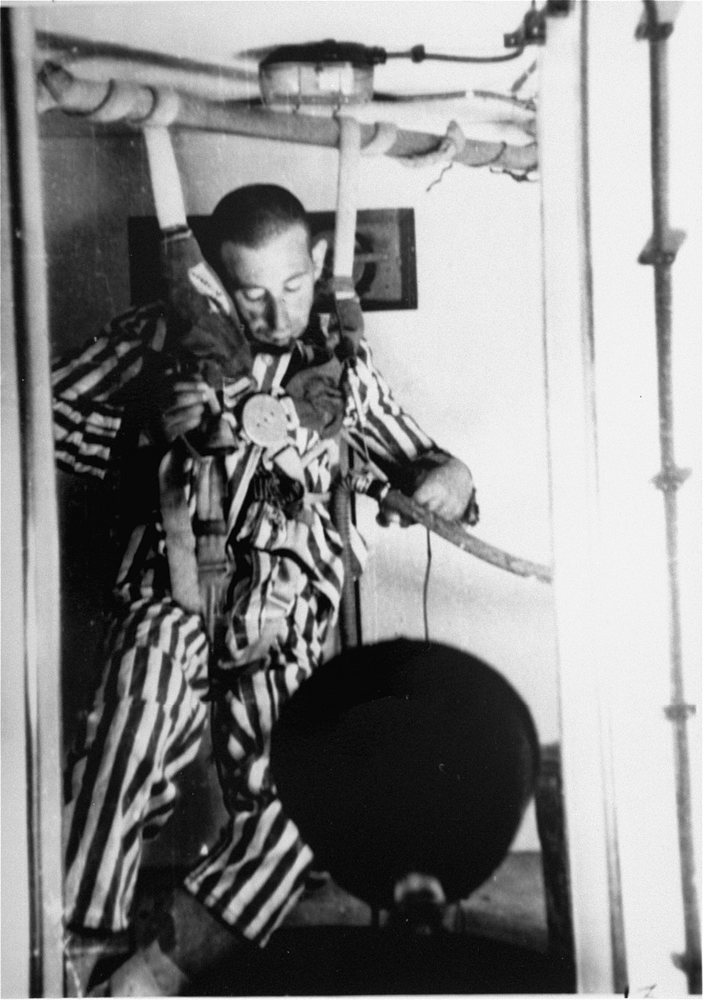
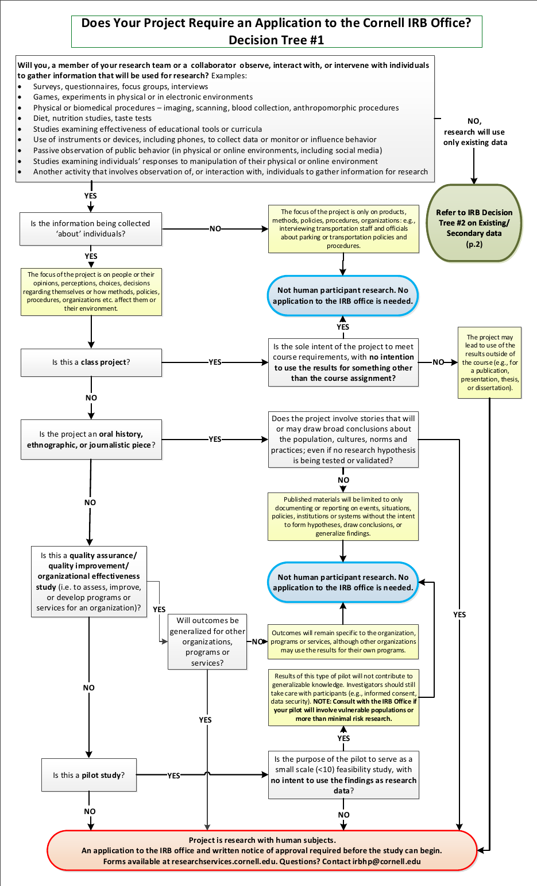
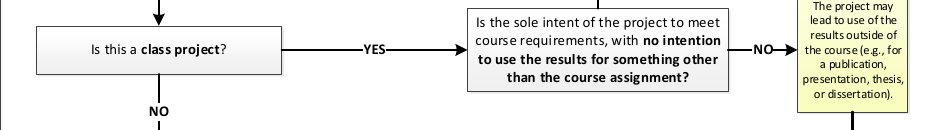
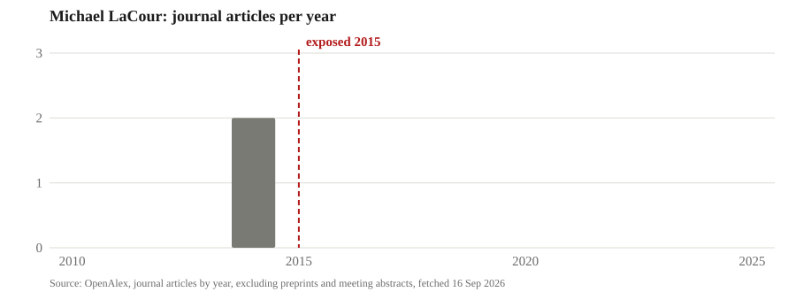

:::: {.content-hidden when-format="revealjs"}

::: {.callout-note appearance="simple"}
[**Open the slides**](04-ethics-slides.html)
:::

**What you should be able to do after this meeting.** Say whether your
project needs IRB review, a data-use agreement, both or neither, and defend
the answer with the branch of Cornell's decision tree it sits on. Name the
date each gate has to start, counted backwards from January. Say what a
fabricated citation is, and what it costs.

::: {.callout-note title="What to take away" appearance="simple"}
A study is a question, the data and the tools. Two more things decide
whether it can happen and whether it survives: **ethical practice** and
**legal obligation**. They are different tests. The Tuskegee study ran for
forty years and nobody was ever prosecuted.

Two gates stand between your design and your data. The **IRB** is an ethics
review, and it applies when you interact with people or hold identifiable
information about them and your results leave the course. A **data-use
agreement** is a contract, and the university signs it, not you. Both run on
clocks you do not control.

You do not decide that you are exempt. The IRB issues that determination, and
it issues nothing until every person on the protocol has finished CITI
training. So everyone in this course completes the training, whether or not
their project needs it.

Removing the names is not de-identification. Nothing at moderate risk or
above goes into a public AI tool.

A fabricated citation is a fabrication. Misconduct is caught by outsiders,
from the data file, after publication, and the price is usually the job.
:::

## Due today

Your project's ethics-and-access checklist, signed by every member, before
you leave. And, individually, your CITI human-participants training
certificate on Canvas before meeting 6, Wednesday September 30.

::::

:::: {.content-visible when-format="revealjs"}

## Why this meeting exists

- A study is a question, the data and the tools to answer it.
- That is how the first three meetings taught you to think about it.
- Two more things decide whether the study can happen, and whether it survives:
  1. Ethical practice: how you treat the people in the data and the people who read the result.
  2. Legal obligation: what a contract, a licence or a regulation lets you do with the data.
- Both have clocks you do not control, and both have a price when ignored.

::: {.notes}
Ninety seconds. This is the motivation the deck lacked. Say it in the first
person: you have spent three weeks on the question and the data, and this
week is the two things that are less emphasised and end more projects.

Most teams will find they trip nothing. The check is what tells you which
teams those are, and a team that finds out in February that it needs a
data-use agreement has lost the semester it was going to run the study in.
:::

## Legal and ethical are different tests

- Legal is a floor set by somebody else: a regulation, a contract, a licence.
- Ethical is a judgement about people who cannot make it for you.
- The Tuskegee study ran for forty years and nobody was ever prosecuted.
- The Facebook experiment broke no law and drew an expression of concern from the journal.
- Reporting one regression out of three breaks no law and has ended careers.
- Some researchers whose data turned out to be fabricated kept their jobs, so consequences are not the test either.
- The National Academies' 2017 report on research integrity tells institutions to go beyond simple compliance.

[National Academies of Sciences, Engineering, and Medicine (2017), Fostering Integrity in Research, Recommendation Two](https://www.ncbi.nlm.nih.gov/books/NBK475939/){style="font-size:0.55em; color:#6b6b6b"}

::: {.notes}
Two minutes. The distinction the whole hour rests on. Say the four cells out
loud. Legal and ethical is most of what you will do. Illegal and unethical
needs no discussion. The two off-diagonal cells are where the hour lives:
legal but unethical, which is Tuskegee and the Facebook study and p-hacking,
and breach-but-defensible, which is scraping public pages for a
public-interest study.

Consequences are not the test, and say so plainly. Wansink resigned. The
author who supplied the fabricated insurance data for the 2012 honesty paper
was cleared by Duke and is still there, and nobody has been found responsible
for the fabrication. The test is what you would say to the participants and
to the reader if they could see everything you did.
:::

# 1. Where the rules come from

## The Nazi medical experiments

:::: {.columns}
::: {.column width="38%"}
{fig-align="center" height="400"}

[A prisoner loses consciousness in a low-pressure chamber at Dachau, 1942. Photographed by the SS doctor running the experiment; later a trial exhibit. USHMM, public domain.]{style="font-size:0.5em; color:#6b6b6b"}
:::
::: {.column width="62%"}
::: {style="font-size:0.7em"}
- From 1942, SS and Luftwaffe doctors ran experiments on concentration-camp prisoners who could not refuse.
- Dachau: prisoners were put in a low-pressure chamber to simulate altitude and in ice water to study freezing, to help downed pilots, and hundreds died or were harmed.
- Ravensbrück: about 80 women, most of them Polish political prisoners, had their legs cut open and infected to test a sulfa drug, and many died.
- Auschwitz: Josef Mengele collected hundreds of pairs of twins and measured, bled and operated on them.
- Sterilisation experiments ran at Auschwitz and Ravensbrück.
- Nobody asked the prisoners, and nobody told them what was being done.
:::
:::
::::

[United States Holocaust Memorial Museum, Holocaust Encyclopedia: Nazi medical experiments; Dachau; Ravensbrück; Josef Mengele](https://encyclopedia.ushmm.org/content/en/article/nazi-medical-experiments){style="font-size:0.55em; color:#6b6b6b"}

::: {.notes}
Ninety seconds, and assume nobody in the room knows this. Tell the three
groups the museum uses: experiments to keep German soldiers alive, trials of
drugs and treatments, and experiments in service of racial ideology.

The photograph is an SS doctor's own record of a man losing consciousness at
a simulated 15,000 metres. It became a prosecution exhibit. Say that before
the slide goes up, so nobody is ambushed by it.
:::

## Which of these experiments would still have been wrong if nobody had been harmed?

- The prisoners could not refuse, and were not told what was being done.
- The experiments were meant to save German pilots and soldiers.

::: {.notes}
One minute. The question is the point of the two slides. The harm is
obvious. The answer the room should reach is that all of them would still
be wrong with no harm at all, because the subjects could not refuse. That
is the sentence the Nuremberg judges wrote first, on the next slide.
:::

## The Nuremberg Code

:::: {.columns}
::: {.column width="42%"}
{fig-align="center" width="100%"}

[The defendants in the dock at the Doctors' Trial, Nuremberg, 1946 to 1947. US Army photograph via USHMM, public domain.]{style="font-size:0.5em; color:#6b6b6b"}
:::
::: {.column width="58%"}
::: {style="font-size:0.67em"}
- In December 1946 a US military tribunal at Nuremberg put 23 doctors and administrators on trial, convicted sixteen and hanged seven.
- The prosecutor opened with "murders, tortures, and other atrocities committed in the name of medical science."
- In August 1947 the judges wrote ten rules for research on people into their judgment, and those rules are the Nuremberg Code.
- Rule one: "The voluntary consent of the human subject is absolutely essential."
- The rest: benefit to society, animal work first, no needless suffering, risk in proportion to importance, qualified scientists, and the subject may stop when going on seems impossible to him.
- Status today: never adopted in full as law by any country, absorbed into the Declaration of Helsinki in 1964 and into US consent rules, and still cited as the starting point.
:::
:::
::::

[USHMM, The Doctors Trial · Trials of War Criminals, vol. 2 (1949), via Yale's Avalon Project · Shuster (1997), NEJM 337:1436](https://avalon.law.yale.edu/imt/nurecode.asp){style="font-size:0.55em; color:#6b6b6b"}

::: {.notes}
Two minutes. The trial ran from December 9, 1946 to the judgment of August
19, 1947, with sentences the next day. Seven acquitted, nine to prison,
seven hanged at Landsberg in June 1948. Mengele was never tried; he escaped
to South America.

The ten points are on the companion page in full. The one to land is the
first, in its own words.

Status: no government adopted it in full as law, with a partial exception
for the US Department of Defense in 1953. It was eclipsed by the Declaration
of Helsinki in 1964 and by the federal regulations, which require exactly
its first rule: legally effective informed consent, free of coercion.
:::

## The Tuskegee syphilis study

:::: {.columns}
::: {.column width="42%"}
{fig-align="center" width="100%"}

[A doctor draws blood from a participant. National Archives, undated, public domain.]{style="font-size:0.5em; color:#6b6b6b"}
:::
::: {.column width="58%"}
::: {style="font-size:0.7em"}
- From 1932 to 1972 the US Public Health Service followed 600 Black men in Macon County, Alabama: 399 with syphilis and 201 without.
- The men were told they had "bad blood", were given free meals, transport and burial insurance, and were never told the diagnosis.
- Penicillin became the standard treatment in the 1940s, and the men were not treated and were kept from treatment.
- By one count, 128 of them died of syphilis or its complications, 40 wives were infected and 19 children were born with congenital syphilis.
- Nobody was ever prosecuted.
- The study ended in 1972 after a Public Health Service employee, Peter Buxtun, gave the documents to the Associated Press.
:::
:::
::::

[CDC, The Untreated Syphilis Study at Tuskegee, timeline · Heller, Associated Press, July 25, 1972 · Equal Justice Initiative](https://www.cdc.gov/tuskegee/about/timeline.html){style="font-size:0.55em; color:#6b6b6b"}

::: {.notes}
Ninety seconds. The study was designed to record the natural course of
untreated syphilis. The men thought they were in a government health
programme. They were given iron tonic, aspirin and placebo injections.

Buxtun objected inside the Public Health Service from 1966 and was rebuked.
He gave the documents to the AP, and Jean Heller's story ran on July 25,
1972. The study was stopped that November. At the start of 1972, 74 of the
untreated men were still alive.
:::

## In which year did the Tuskegee study become wrong?

- Nobody was infected with anything: the men already had the disease.
- The men were never told the diagnosis.
- Penicillin became the standard treatment in the 1940s and was withheld.

::: {.notes}
One minute. The question has two good answers and the room should find
both. It was wrong in 1932, because the men were deceived and never
consented. It became wrong in a second way in the late 1940s, when a cure
existed and was withheld so the study could continue. The Belmont Report
names the second one as the failure of justice.
:::

## What Tuskegee changed

::: {style="font-size:0.86em"}
- The AP story ran on July 25, 1972, and the study ended that November.
- A class action settled in 1974 for 10 million dollars, and President Clinton apologised to the survivors in 1997.
- The National Research Act of 1974 created a national commission on research ethics.
- Its Belmont Report of 1979 set out three principles, and each comes with a practice:
  1. **Respect for persons**, applied as informed consent.
  2. **Beneficence**, applied as weighing risks against benefits and minimising harm.
  3. **Justice**, applied as choosing participants fairly, so the burden does not fall on the disadvantaged.
- The report names Tuskegee as the case where justice failed.
:::

[The Belmont Report, April 18, 1979 · CDC, The Untreated Syphilis Study at Tuskegee, timeline](https://www.hhs.gov/ohrp/regulations-and-policy/belmont-report/index.html){style="font-size:0.55em; color:#6b6b6b"}

::: {.notes}
Two minutes. Belmont is the frame every review board applies. Read the three
principles as questions a board asks: did they agree, knowing what they were
agreeing to; is the risk worth it and as small as it can be; who carries the
risk and who gets the benefit.

The report's own words on Tuskegee: the study "used disadvantaged, rural
black men" and "deprived [them] of demonstrably effective treatment in order
not to interrupt the project, long after such treatment became generally
available."
:::

## Where review boards come from

::: {style="font-size:0.8em"}
- 1966: the Surgeon General makes committee review a condition of Public Health Service grants.
- 1974: the National Research Act writes the "Institutional Review Board" into law for Public Health Service grants, and the first federal regulations follow.
- 1981: the revised HHS regulations.
- 1991: the Common Rule, adopted across federal agencies.
- 2017: the revised Common Rule, in force from January 2019.
- A board has at least five members of varied backgrounds, at least one non-scientist and one person from outside the institution.
- It approves before a study starts, and re-reviews full-board studies at least once a year.
- The rule reaches only research that is federally funded or federally regulated.
:::

[Public Law 93-348 (1974) · 45 CFR 46.101, 46.107 and 46.109 · Federal Register, January 19, 2017](https://www.law.cornell.edu/cfr/text/45/46.107){style="font-size:0.55em; color:#6b6b6b"}

::: {.notes}
Ninety seconds. The board is the machinery that applies Belmont before the
study runs. Every university that takes federal research money has one, and
Cornell's is the IRB office you will meet in ten minutes.

The last bullet sets up the next slide. The federal rule does not reach a
company's own research. What does is on the next slide.
:::

## Review boards outside universities

::: {style="font-size:0.78em"}
- Hospitals and health systems run their own boards, some with patients and community members on them.
- Drug and device trials must go through a board under FDA rules, whoever pays for them.
- Independent boards review for companies: WIRB, founded in 1968 and now WCG, and Advarra.
- A company's A/B test is not federally funded and not FDA-regulated, so no rule requires a board.
- After its 2014 study Facebook set up an internal review panel.
- Microsoft Research has run an ethics review programme since 2013 and a registered IRB since 2017.
- Journals and professional codes reach where the rule does not: the American Economic Association's journals require a statement on IRB approval for any paper that collects data on people.
:::

[21 CFR 56.103 · WCG, history · Microsoft Research Ethics Review Program · Facebook Newsroom, October 2, 2014 · AEA disclosure policy](https://www.aeaweb.org/journals/policies/disclosure-policy){style="font-size:0.55em; color:#6b6b6b"}

::: {.notes}
Two minutes. The answer to "do private companies have anything similar" is:
sometimes, and never because a law made them. Pharmaceutical trials go
through boards because the FDA will not accept the data otherwise. Tech
companies built review panels after they were embarrassed. Economists answer
to their journals.

Say the practical version. If a teammate's firm offers you data on people,
the firm may have no board at all, and that changes nothing about your
obligations; it only changes who checks.
:::

## The Facebook experiment of 2014

:::: {.columns}
::: {.column width="62%"}
::: {style="font-size:0.66em"}
- For one week in January 2012, Facebook changed the News Feeds of 689,003 users, removing some positive posts for one group and some negative posts for another.
- It measured whether the users' own posts turned more positive or negative, and they did, by about a tenth of a percentage point.
- Consent, in the paper's words: the Data Use Policy "to which all users agree prior to creating an account on Facebook".
- Two authors were at Cornell, and Cornell's IRB ruled that they only saw results and were not engaged in human research.
- PNAS published it in June 2014 and issued an expression of concern in July: Facebook owed nothing to the Common Rule, but consent and the chance to opt out are best practice.
- Facebook's answer in October 2014 was an internal review panel and a research website, not an IRB.
:::
:::
::: {.column width="38%"}
{fig-align="center" height="400"}

[PNAS, Editorial Expression of Concern, July 22, 2014.]{style="font-size:0.5em; color:#6b6b6b"}
:::
::::

[Kramer, Guillory and Hancock (2014) · Verma (2014) · Cornell statement, June 30, 2014 · Facebook Newsroom, October 2, 2014](https://doi.org/10.1073/pnas.1320040111){style="font-size:0.55em; color:#6b6b6b"}

::: {.notes}
Two minutes. Give the room the whole story, because most of them were in
school when it happened.

The experiment: for a week, some users saw fewer of their friends' positive
posts and others fewer negative ones. The measure was the words in their
own status updates, classified by software. The effect was tiny and real.
The consent was a clause in the data-use policy, and the paper said so.

The reaction came at the end of June, weeks after the paper went online: an
apology from the Facebook author, and PNAS's expression of concern on July
3, 2014, which is the page on the slide. The journal said a private company
was under no obligation to follow the Common Rule, and then said it was
concerned anyway. Cornell said its professor and his graduate student had
access only to results, so its board never reviewed it. Facebook announced
review guidelines and a panel that October.

Nothing illegal happened. That is why it is here.
:::

## The Cambridge Analytica case

:::: {.columns}
::: {.column width="58%"}
::: {style="font-size:0.66em"}
- In 2013 and 2014 a Cambridge psychologist's quiz app, "thisisyourdigitallife", was installed by about 270,000 people.
- It was described as a research app, and it also took data from the installers' friends, which the platform allowed at the time.
- The data went to Cambridge Analytica, against Facebook's platform policy, and up to 87 million profiles were reached.
- Facebook learned of the transfer in 2015 and took certificates that the data had been deleted, and it had not been.
- The price: a 500,000 pound fine in the UK, the legal maximum; a 5 billion dollar FTC penalty in 2019; the chief executive before Congress.
- The quiz-takers agreed to something, and their friends agreed to nothing.
:::
:::
::: {.column width="42%"}
{fig-align="center" width="100%"}

[Parliament Square, London, March 29, 2018. Photo John Lubbock, CC BY-SA 4.0.]{style="font-size:0.5em; color:#6b6b6b"}
:::
::::

[Facebook Newsroom, March 16 and April 4, 2018 · ICO, October 25, 2018 · FTC, July 24, 2019](https://about.fb.com/news/2018/04/restricting-data-access/){style="font-size:0.55em; color:#6b6b6b"}

::: {.notes}
Two minutes. This case is here for the second half of the lecture as much
as the first: it is a consent failure and a data-agreement failure at once.
Facebook says collecting under a research framing was within its rules; the
FTC later alleged the app lied to users about what it took. Passing the data
to a third party broke the platform's terms. Not deleting it when asked
broke the certification.

The FTC's own words: Facebook "did not screen the developers or their apps
before granting them access to vast amounts of user data." The FTC also sued
Cambridge Analytica and settled with the app developer and the former chief
executive, who must delete everything derived from the data.
:::

## What is different between the Facebook experiment and an ordinary A/B test?

- Facebook runs tests on its feed every day, and nobody calls them research.
- The 2014 study was designed as a study, run by scientists, and published in a journal.
- Both change what people see without telling them.

::: {.notes}
Two and a half minutes. The room talks first, then two or three answers,
then the answer told.

The answer. It was designed to produce generalisable knowledge and it was
published, which is the federal definition of research. So the ethics rules
applied to it and they do not apply to an ordinary A/B test. The terms of
service are not informed consent, which is why PNAS issued an expression of
concern. The Cornell angle is the existing-data branch of the tree, twenty
minutes from now, working: the Cornell authors only saw results.

The point to land: the definition turns on the intent to generalise, not on
whether anybody was hurt. A capstone is written to say something general,
or it is written for one firm. That choice decides which rules apply.
:::

# 2. The IRB

## Two questions decide whether the IRB applies

::: {style="font-size:0.84em"}
1. Is it research: a systematic investigation designed to produce generalisable knowledge?
2. Are there human participants: you interact with people, or you hold identifiable private information about them?

- Examples that count:
  - Scraped posts or reviews where individuals are identifiable.
  - Purchased consumer records with names or addresses.
  - A survey, an interview or an experiment you run yourself.
- Examples that do not:
  - Firm financials from Compustat.
  - Foot-traffic data that arrives aggregated and de-identified.
- Teams miss the second question, because identifiable rows count even if you never meet anybody.
:::

[45 CFR 46.102, the definitions in the Common Rule](https://www.ecfr.gov/current/title-45/subtitle-A/subchapter-A/part-46){style="font-size:0.55em; color:#6b6b6b"}

::: {.notes}
Two minutes. Both questions have to be yes for the IRB to apply. The first
is the one the Facebook discussion just answered. The second is the one
teams get wrong, because they hear "human participants" and think of a
survey.
:::

## Cornell's decision tree

{fig-align="center" height="540"}

[Cornell IRB office, Does your project require an application to the Cornell IRB office? Decision tree 1](https://researchservices.cornell.edu/sites/default/files/2019-05/IRB%20Decision%20Tree.pdf){style="font-size:0.55em; color:#6b6b6b"}

::: {.notes}
Thirty seconds. This is the instrument the IRB office's own staff use, and
it is public. Do not read it. Say that the next three slides walk the three
branches that matter to this room: the class project, the study for one
organisation, and existing data.
:::

## The class-project branch

{fig-align="center" width="100%"}

- The tree asks whether the project is a class project, and then whether its sole intent is to meet the course requirement.
- If the results leave the course, for a publication, a presentation, a thesis or a sponsor's decision, it is research.
- A capstone is the second kind.
- When in doubt you ask irbhp@cornell.edu, because you do not make the call.

[Cornell IRB office, decision tree 1, the class-project row](https://researchservices.cornell.edu/sites/default/files/2019-05/IRB%20Decision%20Tree.pdf){style="font-size:0.55em; color:#6b6b6b"}

::: {.notes}
Two minutes. Read the branch in the tree's own words: "Is the sole intent
of the project to meet course requirements, with no intention to use the
results for something other than the course assignment?" If yes, not human
participant research. If no, the project may lead to use of the results
outside the course, and it continues down the tree.

A capstone whose plan is executed in AEM 6992 and presented to a room, or
handed to a sponsor, is outside the course. So the class-project branch does
not rescue you. Say that before anybody hopes it does.
:::

## The one-organisation branch

{fig-align="center" width="92%"}

::: {style="font-size:0.84em"}
- The tree has a branch for quality improvement: a study to assess or improve one organisation's own programmes or services.
- If the outcomes stay specific to that organisation, it is not human participant research, even if other organisations might use the results.
- That is last week's private value: a project run for one firm's decision.
- Written to say something about people in general, the same project is research.
- The choice is made before the data is collected, not after.
:::

[Cornell IRB office, decision tree 1, the quality-improvement branch](https://researchservices.cornell.edu/sites/default/files/2019-05/IRB%20Decision%20Tree.pdf){style="font-size:0.55em; color:#6b6b6b"}

::: {.notes}
Ninety seconds. This is the branch the finance and marketing teams are on,
and it is the private-value project from meeting 3 in the IRB office's own
words. A study whose outcomes stay with one firm needs no application. The
moment the same project is written to say something about people in general,
it is research. Teams can choose which of these they are, and the choice
has to be made before the data is collected.
:::

## Research inside a company

::: {style="font-size:0.8em"}
- Most research inside firms is done for the firm's own decisions: A/B tests, HR analytics, customer surveys.
- No federal rule requires a board for it, and Cornell's tree calls it quality improvement.
- The moment the results are meant to go outside, to a journal, a conference, a client or a thesis, it is research and the rules apply.
- No board in the building does not make a study ethical, because the Belmont principles do not depend on who pays.
- The consequences arrive without a board too: Facebook in 2014, AOL's search logs in 2006, Uber's "God View" in 2014.
- Three habits travel anywhere:
  1. Ask people where you can.
  2. Collect the minimum.
  3. Have somebody with no stake read the plan.
:::

[NASEM (2017), Fostering Integrity in Research · NBC News, August 7, 2006 · FTC, August 15, 2017, Uber settlement](https://www.ftc.gov/news-events/news/press-releases/2017/08/uber-settles-ftc-allegations-it-made-deceptive-privacy-data-security-claims){style="font-size:0.55em; color:#6b6b6b"}

::: {.notes}
Two minutes. Several people in this room work, or will work, in firms that
run research on customers and employees every day, and this is the slide
for them.

Inside the firm, for the firm: no board is required, and Cornell's tree
would call it quality improvement. Meant for outside: research, with all of
this hour attached. And the third case, which is the one that matters: a
firm with no board is not a firm with no ethics. AOL posted 20 million
search queries for researchers in 2006; a user was identified by name within
days, the chief technology officer resigned and two employees were fired.
Uber's "God View" let staff watch riders' trips; a journalist was tracked
without permission in 2014, and the state and federal settlements followed.
Nobody at AOL needed an IRB to lose those jobs, and Uber needed none to end
up under a twenty-year audit.

The three habits are the Belmont principles in working clothes.
:::

## Cornell's decision tree for existing data

{fig-align="center" height="540"}

[Cornell IRB office, Decision tree 2, research involving secondary or existing data](https://researchservices.cornell.edu/sites/default/files/2019-05/IRB%20Decision%20Tree.pdf){style="font-size:0.55em; color:#6b6b6b"}

::: {.notes}
Thirty seconds. Page two of the same document, for the projects most of this
room is running. The next slide reads it.
:::

## Existing data has its own tree

- Are the rows about people who may still be living?
- Is the file publicly available?
- Can you link a row to a living person, directly or through a code?
- If you cannot, and the provider is not your collaborator, it is not human participant research.
- What the vendor calls the file is not one of the questions.

[Cornell IRB office, decision tree 2, research involving secondary or existing data](https://researchservices.cornell.edu/sites/default/files/2019-05/IRB%20Decision%20Tree.pdf){style="font-size:0.55em; color:#6b6b6b"}

::: {.notes}
Ninety seconds. Walk it. Living people, or it is out. Publicly available,
and it is out. Not public: can you, the recipient, link a row to a person,
directly or through a code the provider holds? If not, and the provider is
just providing, it is not human participant research.

The last bullet is the one to say twice. The tree asks what you can do with
the rows. It does not ask what the vendor wrote on the invoice.
:::

## Which of these needs an application?

- An online experiment on a nutrition label with three hundred paid participants, results to your proposal.
- Foot-traffic data from Dewey, aggregated and de-identified before you see it.
- Glassdoor reviews scraped with usernames, to say something about employers in general.
- Firm financials from Compustat.

::: {.notes}
Two minutes. A short silent write on the strip, then told.

The first and the third. The experiment interacts with people and its
results leave the course. The scrape is passive observation of public
behaviour online, which the tree lists by name, and the rows are
identifiable. It goes to the office, it will probably come back exempt, and
the office says so, not you. The scrape also trips a second gate, terms of
service, which is twenty minutes from now.

Dewey arrives aggregated and de-identified, which is the existing-data tree
saying no. Compustat is not about individuals at all.
:::

## Three levels of review measured in weeks

::: {style="font-size:0.84em"}
1. An exemption takes three to four weeks from start to finish at Cornell.
2. Expedited review takes four to six.
3. The full board takes four to eight and meets on the first Friday of the month.

- You do not decide that you are exempt: the IRB issues that determination.
- A student protocol needs a faculty advisor who answers for it, and in this course that is me.
- Boards differ on what they call exempt, on turnaround and on whether coursework counts, and a partner at another university means a second review.
:::

[Cornell IRB, the life cycle of an IRB protocol · IRB FAQs · PI eligibility](https://researchservices.cornell.edu/resources/life-cycle-irb-protocol){style="font-size:0.55em; color:#6b6b6b"}

::: {.notes}
Ninety seconds. The weeks are Cornell's own, from the IRB office's page on
the life cycle of a protocol, and they assume a complete submission. An
incomplete one goes back and the clock restarts.

The full board's clock is a calendar, not a queue. Miss the deadline for one
meeting and the next one is a month away.

A student cannot usually be the principal investigator. A protocol needs a
faculty advisor who takes responsibility for compliance, and for this course
that is me. So the draft goes past me before it goes to the IRB, and the
instrument and the consent language come to office hours first.
:::

## Training comes first and it is required

- Every person named on a protocol completes CITI human-participants training, exempt protocols included.
- The IRB issues nothing until the last name on the protocol has finished.
- The course takes two to four hours and lasts five years.
- Everyone in this room completes it and uploads the certificate to Canvas before meeting 6, Wednesday September 30.
- Do it before you know whether you need it, because one teammate who skipped it holds up the whole team.

[Cornell IRB training · IRB news, October 2022: training required for exempt research](https://researchservices.cornell.edu/resources/irb-training){style="font-size:0.55em; color:#6b6b6b"}

::: {.notes}
Ninety seconds, and this slide is protected in the cut order because the
requirement is graded and has to be said in the room.

Say the mechanism once, in the syllabus's words. Register at citiprogram.org
under the Cornell affiliation. Take the course Cornell accepts, which is
called IRB Training or IRB Basic. Download the completion certificate and
upload it to the Canvas assignment by Wednesday September 30 at 11:59 pm.
Not there by then costs five participation points.
:::

# 3. Contracts and terms

## When data is used beyond what was agreed

::: {style="font-size:0.52em"}
| Case | What was agreed | What happened | The price |
|:--|:--|:--|:--|
| Havasupai, 1990 to 2010 | Blood given by tribe members for diabetes research | Used in studies of schizophrenia, migration and inbreeding, found out at a dissertation defence in 2003 | The Board of Regents settled in 2010: 700,000 dollars, the samples returned, an apology |
| Royal Free and DeepMind, 2015 to 2017 | Nothing that told the patients | A London hospital trust gave Google DeepMind the records of 1.6 million patients to build an app | The UK regulator ruled in 2017 that the trust had broken data protection law |
| Harvard's "Tastes, Ties and Time", 2008 | Terms of use forbade re-identifying the anonymised cohort of 1,700 | Identified as a Harvard cohort within days, from the codebook and public comments | Taken offline within a fortnight, and still offline two years later |
| AOL, 2006 | No agreement at all | Twenty million queries from 658,000 users posted for researchers, and the New York Times identified user 4417749 by name | The chief technology officer resigned and two employees were fired |
:::

::: {style="font-size:0.78em"}
- The harm came from use beyond the stated purpose, and a data-use agreement fixes the purpose, the recipients and the exit.
:::

[Embryo Project Encyclopedia, Havasupai Tribe v. Arizona Board of Regents · ICO, July 3, 2017 · Zimmer (2010), Ethics and Information Technology 12:313 · World Privacy Forum, August 8, 2006](https://embryo.asu.edu/pages/havasupai-tribe-v-arizona-board-regents-2008){style="font-size:0.55em; color:#6b6b6b"}

::: {.notes}
Three minutes, one case at a time, and the bullet under the table is the
lesson. Havasupai is the case to tell in most detail: the consent form said
"the causes of behavioral/medical disorders", the tribe understood diabetes,
and the samples fed 23 papers and dissertations, 15 of them on something
else. The tribe sued in 2004; the Board of Regents settled in April 2010,
with the blood returned.

Royal Free is the one for anybody planning to work with a firm's customer
records: the transfer itself was the breach, because nobody told the
patients. Harvard's dataset is the one for anybody who thinks anonymised
means anonymous. AOL is the one for anybody who thinks a research release is
harmless because the users are numbers.
:::

## A data-use agreement is a contract

::: {style="font-size:0.84em"}
- It is not an ethics review and it does not replace one.
- The university signs it, through the Office of Sponsored Programs, not you.
- Expect legal review on both sides and expect months.
- It binds Cornell, and it binds you through Cornell, so a breach is the university's problem and then yours.
- OSP is asked at osp_dua@cornell.edu, and whether it will sign for a class project is a question to ask in October, not assume.
:::

[Cornell Research Services, exchange commercially unavailable or restricted data](https://researchservices.cornell.edu/resources/exchange-commercially-unavailablerestricted-data){style="font-size:0.55em; color:#6b6b6b"}

::: {.notes}
Two minutes. The second gate, and a different kind of thing.

A data-use agreement governs somebody else's proprietary data. It is
negotiated by lawyers on both sides. At Cornell the Office of Sponsored
Programs is the party that enters into agreements for the use of data. You
are not a party. You cannot accept a firm's terms on the team's behalf,
however reasonable they look.

Is it legally binding? Yes. It binds the university, and you are bound
through the university, so a breach is a matter between the firm and Cornell
first and between Cornell and you second.
:::

## What the clauses do

- Publication review is normal and a veto is not, so settle it before anybody signs.
- Destruction at the end, no redistribution, and no attempt to re-identify are standard.
- The agreement names who may touch the file and where it may live.
- Most of what Cornell licenses is for academic non-commercial use, WRDS and Compustat included.
- A project a firm would pay for cannot be built on a licence that forbids commercial use.

[Cornell Research Services, exchange restricted data · WRDS terms of use](https://researchservices.cornell.edu/resources/exchange-commercially-unavailablerestricted-data){style="font-size:0.55em; color:#6b6b6b"}

::: {.notes}
Two minutes. Read the clauses as things that will happen to your project.

Publication review means the firm sees the write-up before it goes out and
can ask for its confidential figures to be removed. A veto means the firm
can stop the write-up. Review is normal. A veto means you may not be able to
show your own result, and it is settled before signing or the project has no
result.

The last two bullets are the graft from meeting 3. Last week some of you
took private value seriously: a question one firm would pay for. This week,
check the licence on the file you would answer it with.
:::

## Terms of service are a contract

::: {style="font-size:0.8em"}
- Terms of service are a contract you accepted by clicking.
- Scraping is rarely a crime and frequently a breach.
- An appeals court let a scraper keep taking public LinkedIn pages, finding a serious question whether that is a computer crime at all.
- The district court then found the same scraper had breached the user agreement, and the case ended in a 500,000 dollar judgment and an order to delete the data.
- In 2021 Facebook shut down NYU researchers' accounts over a browser extension that collected political ads with the users' consent, citing its terms of service.
- Prefer the download, then the API, then nothing.
- The vendor's terms decide what you may publish, so read them before the file is on your laptop.
:::

[hiQ Labs v. LinkedIn, Ninth Circuit, April 18, 2022, and N.D. Cal., November 4, 2022 · Sandvig v. Barr, D.D.C., March 27, 2020 · Facebook Newsroom, August 3, 2021](https://cdn.ca9.uscourts.gov/datastore/opinions/2022/04/18/17-16783.pdf){style="font-size:0.55em; color:#6b6b6b"}

::: {.notes}
Two minutes. The terms of service are a data-use agreement you signed
without reading, and the same three things are in them: what you may take,
what you may keep, what you may publish.

The LinkedIn case is the one people cite for "scraping is legal". Read it
carefully and it says less than that. The appeals court in 2022 affirmed an
injunction letting hiQ keep scraping, because there was a serious question
whether taking public pages is unauthorised access under the computer crime
statute. The district court then found hiQ had breached the user agreement
by creating fake accounts, left the scraping claim for trial, and the
parties settled in December 2022 with a 500,000 dollar consent judgment and
an order to delete the data. Rarely a crime, frequently a breach. Both
halves are true at once. A separate 2020 ruling, Sandvig v. Barr, held that
breaking a website's terms for a research audit is not a crime either.

The NYU case is the university version: the researchers had the users'
consent, and the platform cut them off anyway. The FTC told Facebook its
excuse was inaccurate.
:::

## Employer data brings its own clauses

- A teammate's employer may offer data under a non-disclosure agreement.
- An NDA that covers the result blocks the presentation in this room in December.
- Settle who owns the output before the file arrives.
- A sponsor may have the right to review and never the right to veto.
- A conflict of interest is disclosed rather than confessed: it tells the reader how to weight your claim and nothing more.

::: {.notes}
Ninety seconds. Several of you have a former or current employer who would
hand over data. Good. Three clauses to settle before it arrives: the NDA,
ownership, and the review clause. And the conflict, which is disclosed on
the title page in one sentence.
:::

# 4. Handling personal data

## Removing the names is not de-identification

::: {style="font-size:0.84em"}
- ZIP code, birth date and sex together identify 87 percent of Americans uniquely.
- Latanya Sweeney used them to pull the governor of Massachusetts's records out of a de-identified hospital file.
- Netflix released anonymised movie ratings and two researchers matched them to named IMDb reviewers.
- New York released taxi trips with hashed medallion numbers and the hashes were reversed in hours.
- Direct identifiers are the easy part and quasi-identifiers are the file.
:::

[Sweeney (2000), Simple demographics often identify people uniquely · Narayanan and Shmatikov (2008), IEEE S&P · Pandurangan (2014), Of taxis and rainbows](https://dataprivacylab.org/projects/identifiability/paper1.pdf){style="font-size:0.55em; color:#6b6b6b"}

::: {.notes}
Two minutes. Three stories, and each one is a file somebody in this room
would happily download.

Sweeney, 1997: Massachusetts released hospital discharge records with names
removed. She bought the Cambridge voter roll, joined on ZIP, birth date and
sex, and mailed the governor his own records. Netflix, 2006: half a million
users' ratings, names replaced by numbers, released for a prize; a handful
of dated ratings matched to public IMDb reviews identified people. New York,
2014: a year of taxi trips with medallion numbers hashed; the hash was a
standard one over a small set of possible numbers, so a developer reversed
every hash in a few hours.
:::

## Does this vendor file trip a gate?

- A vendor sells a consumer file as de-identified.
- Each row carries ZIP code, birth year and sex.

::: {.notes}
Two minutes. The room talks, then told.

Yes. The tree asks whether you can link a row to a living person, not what
the vendor calls the file, and the previous slide says that you can. So it
goes to the IRB office, whose likely answer is that it is exempt, or not
human research once the fields are coarsened. The honest version is the
same project on three-digit ZIP and five-year age bands, or on the vendor's
own aggregates, and it is decided before the file is opened. A vendor's word
for de-identified is a sales claim.
:::

## Where the file may live

::: {style="font-size:0.84em"}
- Cornell classifies data as low, moderate or high risk.
- Student records and anything under FERPA sit at moderate risk, and proprietary and licensed data are covered by the same rule.
- Identifiers paired with a name, health records and financial account data sit at high risk.
- Cornell's rule: do not enter data at moderate risk or above into a publicly available generative AI platform.
- The approved tools are listed at the AI Innovation Hub, and next week's session runs on that list.
:::

[Cornell IT, regulated data · Cornell AI Innovation Hub, tools and resources · Cornell guidelines for artificial intelligence](https://innovationhub.ai.cornell.edu/tools-resources/){style="font-size:0.55em; color:#6b6b6b"}

::: {.notes}
Two minutes. Where the file lives is not a preference.

The AI rule is quoted from Cornell's own page in those words: do not enter
any data classified as moderate risk or above into a publicly available
generative AI platform. Anything you put into a public tool is treated as
public. Next week you drive an assistant on a file, and the file is one you
are allowed to upload, or the assistant sees column names and five invented
rows and the code runs on your laptop.
:::

## Collect only what you need

- A column you did not need is a risk you did not need.
- Salary expectations and visa status in a survey of your own classmates are two such columns.
- Cornell has a policy on research with Cornell students, and surveying your classmates trips it.
- Asking a person for less is the cheapest privacy protection there is.

[Cornell IRB Policy 15, research involving Cornell students](https://researchservices.cornell.edu/policies/irb-policy-15-research-involving-cornell-students){style="font-size:0.55em; color:#6b6b6b"}

::: {.notes}
Ninety seconds. Every column you collect is a column you have to protect,
store on the right system, and one day destroy. Cornell has a specific
policy on research where Cornell students are the participants, because of
the pressure a classmate or an instructor can put on a student to take part.
:::

# 5. Research integrity

## The case of Diederik Stapel

::: {style="font-size:0.8em"}
- A social psychologist at Tilburg who, for years, invented the data behind his own papers and his students' dissertations.
- Three junior researchers in his department noticed the data were too clean and reported him in August 2011.
- The university's inquiry found fraud in 55 publications and parts of 10 doctoral dissertations, and Retraction Watch counts 58 retractions.
- He was suspended, then dismissed, and gave back his doctorate.
:::

{fig-align="center" width="72%" .nostretch}

[Levelt, Noort and Drenth committees (2012), Flawed Science · Retraction Watch leaderboard · OpenAlex](https://www.tilburguniversity.edu/sites/default/files/download/Final%20report%20Flawed%20Science_2.pdf){style="font-size:0.55em; color:#6b6b6b"}

::: {.notes}
Two minutes. Lead the section with the cleanest case: he made up the
numbers, and the people who caught him were the most junior people in the
building.

The chart is publications per year from OpenAlex, with the year the case
broke marked. It is the shape of every case in this section: a career that
stops. Google Scholar keeps counting citations to retracted papers, which is
why the deck shows output rather than citations.
:::

## Three words cover research misconduct

1. **Fabrication** is making up data or results.
2. **Falsification** is changing or omitting data or results so that the record misrepresents the research.
3. **Plagiarism** is presenting somebody else's ideas, processes, results or words as your own.

- A finding requires a significant departure from accepted practice, done intentionally, knowingly or recklessly.
- Honest error and differences of opinion are not misconduct.
- A citation that does not exist is a fabrication, whoever or whatever produced it.

[42 CFR Part 93, the federal definition of research misconduct and the requirements for a finding](https://www.ecfr.gov/current/title-42/chapter-I/subchapter-H/part-93){style="font-size:0.55em; color:#6b6b6b"}

::: {.notes}
Ninety seconds. The federal definition, one line each. It is short on
purpose. The first bullet under the list is the standard a committee has to
meet, and the second is why Reinhart and Rogoff are on a later slide as a
contrast and not as a case. The last bullet comes back on the lawyers'
slide.
:::

## Detrimental practices that fall short of misconduct

::: {style="font-size:0.78em"}
- **p-hacking**: trying specifications, samples or measures until a result clears the line.
- **HARKing**: presenting a result found after the fact as the hypothesis you started with.
- **Selective reporting**: publishing the studies and measures that worked and dropping the rest.
- **Duplicate publication** and **self-plagiarism**: the same result sold twice.
- **Image and data manipulation** short of falsification, and **failure to keep the data**.
- **Gift, ghost and coerced authorship**, and leaving out people who earned it.
- In a 2012 survey of 2,155 psychologists, 46 percent admitted selectively reporting studies that worked and 27 percent admitted HARKing.
- The National Academies call these detrimental research practices, and say they may cost more than misconduct does.
:::

[John, Loewenstein and Prelec (2012), Psychological Science 23:524 · NASEM (2017), Fostering Integrity in Research](https://www.cmu.edu/dietrich/sds/docs/loewenstein/MeasPrevalQuestTruthTelling.pdf){style="font-size:0.55em; color:#6b6b6b"}

::: {.notes}
Two minutes. The three words are the crimes. This slide is the
misdemeanours, and they are far more common. The survey figures are the
control-group self-admission rates, with no incentive for honesty; the group
given an incentive to tell the truth admitted more, so these are floors.

The point for March: none of these requires inventing a number. They only
require not writing down what you did.
:::

## The case of Michael LaCour

::: {.columns}
::: {.column width="50%"}
::: {style="font-size:0.78em"}
- A 2014 paper in Science claimed that one conversation with a gay canvasser changed voters' minds on same-sex marriage for months.
- In 2015 two graduate students who wanted to extend it could not reproduce its properties, and the survey firm said it had no record of the study.
- The senior co-author asked Science to retract, and LaCour never produced the data.
- Princeton withdrew his job offer, and the two graduate students are now professors.
:::
:::
::: {.column width="50%"}
{fig-align="center" width="100%"}
:::
:::

[Retraction Watch, May 20 and May 28, 2015, and June 6, 2025 · OpenAlex](https://retractionwatch.com/2015/05/28/science-retracts-troubled-gay-canvassing-study-against-lacours-objections/){style="font-size:0.55em; color:#6b6b6b"}

::: {.notes}
Ninety seconds. The chart is three years long, which is the point. Broockman
and Kalla were graduate students at Berkeley who liked the paper enough to
build on it. The senior author, Donald Green, admitted he had never checked
the survey files himself and asked for the retraction; Science retracted
over LaCour's objection, five months after publication. Broockman's line ten
years on: "The hero here is open data."
:::

## The case of Francesca Gino

::: {.columns}
::: {.column width="50%"}
::: {style="font-size:0.76em"}
- A Harvard Business School professor whose work on honesty and creativity was among the most cited in the field.
- In June 2023 three bloggers showed, from metadata inside an Excel file, that rows had been moved between conditions in one study, and raised the same alarm on three more papers.
- Harvard's investigation found multiple instances of research misconduct, and she was put on unpaid leave and sued for 25 million dollars.
- The defamation claims were dismissed in 2024, and Harvard revoked her tenure in May 2025, a first in decades.
:::
:::
::: {.column width="50%"}
{fig-align="center" width="100%"}
:::
:::

[Data Colada 109 and 118 · The Harvard Crimson, September 12, 2024 · Inside Higher Ed, May 27, 2025 · OpenAlex](https://datacolada.org/109){style="font-size:0.55em; color:#6b6b6b"}

::: {.notes}
Ninety seconds. The detection method is the teaching point: Excel keeps a
calculation chain inside the file, and the order of that chain showed that
six rows had been moved between conditions after the data were entered. A
forensics firm later found 168 altered observations in another study, all in
the direction of the hypothesis.

Every cell on this slide is a retraction notice, a court ruling or Harvard's
own action. Say nothing the sources do not.
:::

## The case of Brian Wansink

::: {.columns}
::: {.column width="50%"}
::: {style="font-size:0.68em"}
- Cornell's Food and Brand Lab, in this school, published hundreds of papers on eating behaviour.
- In November 2016 he wrote a blog post describing how a student re-analysed a null result until four papers came out of it.
- Three researchers found about 150 statistical inconsistencies in those four papers from the reported numbers alone.
- In September 2018 the JAMA journals retracted six papers after Cornell told them it could not vouch for the results.
- Cornell's committee found academic misconduct: misreporting of data, problematic statistics, failure to keep records and inappropriate authorship.
- He resigned, with eighteen retractions.
:::
:::
::: {.column width="50%"}
{fig-align="center" width="100%"}
:::
:::

[van der Zee, Anaya and Brown (2017) · Retraction Watch, September 19, 2018 · Cornell Chronicle, September 20, 2018 · OpenAlex](https://news.cornell.edu/stories/2018/09/provost-issues-statement-wansink-academic-misconduct-investigation){style="font-size:0.55em; color:#6b6b6b"}

::: {.notes}
Two minutes. This one happened in this building, and it is the case closest
to what this room will actually be tempted to do. Nothing was invented. A
dataset that showed nothing was sliced until it showed something, four
times, and the blog post said so proudly.

The inconsistencies were found from the published tables alone: sample
sizes that could not produce the reported means, degrees of freedom larger
than the sample. Then Cornell's committee, the provost's statement of
September 20, 2018, and retirement at the end of that academic year.
:::

## The 2012 honesty-pledge paper

::: {style="font-size:0.8em"}
- A field experiment with an insurer, published in PNAS in 2012, found that signing an honesty pledge at the top of a form cut dishonest reporting.
- In 2021 the same bloggers showed the insurance data were fabricated: mileage uniformly random up to 50,000, and half the rows in a different font, near-duplicates of the other half.
- PNAS retracted it, and the insurer later said the data in the paper did not match what it had supplied.
- Duke investigated the author who supplied the data for three years and, in a statement it let him post, found no evidence he falsified it and said he should have done more to prevent faulty data from being published.
- Who fabricated the data is not established.
:::

[Data Colada 98 (August 17, 2021) · Retraction Watch, September 14, 2021 · NPR, July 27, 2023 · Ariely, statement approved by Duke, April 2, 2024](https://datacolada.org/98){style="font-size:0.55em; color:#6b6b6b"}

::: {.notes}
Ninety seconds. The case is here because it is unresolved, and that is its
lesson: a paper can be dead while nobody has been found responsible. Say
nothing about who did it, because nobody has established that. The author
who supplied the data remains a professor at Duke. There is no chart on
this slide, because a chart titled with an author's name would attribute a
fabrication that Duke did not find.
:::

## How misconduct gets caught

::: {style="font-size:0.68em"}
| Case | What was wrong | Who caught it and how | The price |
|:--|:--|:--|:--|
| Stapel, 2011 | Invented the data for dozens of papers | Three junior researchers in his own department reported him | His chair, his doctorate and 58 papers |
| LaCour, 2015 | A survey that was never run | Two graduate students tried to replicate it and found the survey firm had no record | The paper and a job offer |
| Wansink, 2017 | Null results re-analysed until they were papers | Three outside researchers found 150 inconsistencies in the reported statistics | His position and 18 papers |
| The 2012 honesty-pledge paper, 2021 | Fabricated rows in an insurance field experiment | Three bloggers found two fonts in one column | The paper |
| Gino, 2023 | Altered rows in four papers | The same bloggers read the metadata inside an Excel file | Tenure at Harvard, revoked in 2025 |
:::

[Sources for each row are on the case slides and in the companion page's table of cases](04-ethics.html#the-cases-in-full){style="font-size:0.55em; color:#6b6b6b"}

::: {.notes}
Ninety seconds. Read the third column down, not the rows across. Nobody in
this table was caught by a reviewer or an editor.
:::

## Every case was caught from the file

- Every case was caught by outsiders or juniors.
- Every case was caught from the data file or the reported numbers, not from the prose.
- Every case was caught after publication, most of them years after.
- The price was usually the job.
- Keep the raw file, one path from raw to result, and a note saying where the raw came from, and this is why.

::: {.notes}
One minute. Nobody was caught by the review process. They were caught by
people with no stake, who asked for the file, opened it, and looked. The
reproducibility habits of next week are what lets an honest researcher show
the file and be believed.
:::

## The Reinhart and Rogoff spreadsheet error

::: {style="font-size:0.8em"}
- In 2010 two prominent economists, Carmen Reinhart and Kenneth Rogoff, reported that growth collapses once public debt passes 90 percent of GDP.
- The number was cited in the austerity debates: it was the only evidence on debt and growth in Paul Ryan's 2013 budget, and the EU's economics commissioner quoted it.
- In 2013 a graduate student at Massachusetts Amherst asked for the spreadsheet for a class replication, and got it.
- Five countries were missing from an average because an Excel range stopped short, some early years were left out, and countries were weighted equally whatever their number of years.
- Corrected, growth above the threshold was 2.2 percent, not minus 0.1.
- They conceded the coding error, "full stop", and defended the rest.
- Not misconduct, and caught the same way.
:::

[Reinhart and Rogoff (2010), AER 100(2) · Herndon, Ash and Pollin (2013), PERI WP 322 · Reinhart and Rogoff, response, April 17, 2013](https://peri.umass.edu/wp-content/uploads/joomla/images/WP322.pdf){style="font-size:0.55em; color:#6b6b6b"}

::: {.notes}
Two minutes. The contrast case, and give it context because the room does
not know it. "Growth in a Time of Debt" was a short paper in the American
Economic Review's Papers and Proceedings, May 2010. Its headline was a cliff
at 90 percent of GDP. It was the only evidence on debt and growth cited in
Paul Ryan's 2013 budget, and the EU's economics commissioner, Olli Rehn,
quoted it to the ILO in April 2013.

Thomas Herndon was a graduate student in a replication class. Reinhart and
Rogoff sent him the spreadsheet. The formula covered fifteen rows where it
should have covered twenty, so Australia, Austria, Belgium, Canada and
Denmark dropped out of the average. Herndon, Ash and Pollin also objected to
excluded years and to weighting each country once regardless of how many
years it contributed. Reinhart and Rogoff's reply conceded the coding error
in those words and disputed the rest.

Not misconduct: an honest error, which the definition excludes. Same
lesson: the file is what gets checked.
:::

## "It was the AI's fault" is not an excuse

::: {style="font-size:0.7em"}
- In 2023 two New York lawyers filed a brief citing six court opinions that did not exist.
- An AI assistant, ChatGPT, had invented them, with plausible names, courts and citations.
- Judge Castel fined the lawyers and their firm 5,000 dollars, and made them write to every judge falsely named as the author of an opinion.
- The judge wrote that "there is nothing inherently improper about using a reliable artificial intelligence tool for assistance", so the fault was not checking.
- The syllabus says the same thing: undisclosed AI use and a fabricated citation are both integrity violations.
:::

{fig-align="center" width="74%" .nostretch}

[Mata v. Avianca, Inc., No. 22-cv-1461 (S.D.N.Y. June 22, 2023), opinion and order on sanctions, from page 1](https://caselaw.findlaw.com/court/us-dis-crt-sd-new-yor/2335142.html){style="font-size:0.55em; color:#6b6b6b"}

::: {.notes}
Ninety seconds. The case that is live in this room. A personal-injury suit
against an airline. One lawyer asked ChatGPT for precedents, got six, and
his colleague filed them. Opposing counsel could not find them. The judge
could not find them. The court found bad faith in the "conscious avoidance
and false and misleading statements" that followed, not in the use of the
tool. The image is the first page of the sanctions order, with the sentence
on the slide in it.

Next week you learn how assistants produce these, and why a DOI that
resolves to a different paper is the tell.
:::

## Is reporting one specification out of three misconduct?

- A team runs three specifications and reports the one that worked.
- Is it fabrication, falsification, plagiarism or none of them, and what is the honest version?

::: {.notes}
Two minutes. The room talks, then told.

It is not fabrication or falsification under the definition. Nothing was
invented and nothing was changed. It is selective reporting, from the
detrimental-practices slide, and it is the practice most of the retracted
social science of the last decade was built on, because reporting the
survivor of many tries presents a fluke as a finding.

The honest versions are two. Report all three and say why they differ. Or
write the specification down before you run it, which is what
pre-registration is, and the December proposal is where you do that. In
March every team in this room will have three specifications and one of
them will look better.
:::

# 6. The calendar

## Run the calendar backwards from January

::: {style="font-size:0.7em"}
| Gate | Cornell's clock | So it starts by |
|:--|:--|:--|
| CITI training | Two to four hours, and nothing is issued until everyone has it | September 30, meeting 6 |
| Terms of service and licences | An afternoon of reading | This week, for every source on your map |
| An IRB exemption or expedited review | Three to six weeks after a complete submission | Draft the instrument and consent in October, submit by early November |
| The full board | Four to eight weeks, first Friday of the month | Submit by late October for a January start |
| A data-use agreement | Months, and it may fail | Ask OSP in October, and carry a plan B |
| AEM 6992 | Starts in late January | Everything above clears before it |
:::

[Cornell IRB, the life cycle of an IRB protocol · IRB FAQs · Cornell Research Services, restricted data](https://researchservices.cornell.edu/resources/life-cycle-irb-protocol){style="font-size:0.55em; color:#6b6b6b"}

::: {.notes}
Three minutes, and this slide is never cut. Read the third column bottom to
top. A team that finds out in February that it needs any of this has lost
the semester it was going to run the study in. That is the argument for
holding this meeting in September.
:::

## After the break

- One shared case.
- Your own project's checklist.
- Every team's gates.

::: {.notes}
One minute. The check-in first, on the sheet in the envelope. Then the
shared card, answered on paper. Then the checklist, signed by every member.
Then every team at the front, in letter order, with the next team standing
at the side, and the timer is real. Read the Poll Everywhere join code out
from the front at 3:08, or write it on the board, so devices are joined
before the quiz opens.
:::

## Quiz

- Three questions on today's session.
- The quizzes run on Poll Everywhere, six across the term, each closing session A, and the lowest score is dropped.

::: {.notes}
Items in _quizzes/s04-ethics-import.txt, run through Poll Everywhere, which
is the quiz mechanism the syllabus promised and meeting 2 rehearsed. Whether
this one counts is decided before the file is converted, and the run of show
in _quizzes/s04-ethics.md records the default.
:::

::::

:::: {.content-hidden when-format="revealjs"}

## Session A · 2:05 to 3:15

The hour opens with why it exists, and then has six parts.

### Why this meeting exists

A study is a question, the data and the tools to answer it. That is how you
have been taught to think about it, and it is what the first three meetings
were about. Two more things decide whether the study can happen, and whether
it survives. Ethical practice: how you treat the people in the data and the
people who read the result. Legal obligation: what a contract, a licence or
a regulation lets you do with the data. Both have clocks you do not control,
and both have a price when ignored.

They are different tests. Legal is a floor set by somebody else. Ethical is
a judgement about people who cannot make it for you. The Tuskegee study ran
for forty years and nobody was ever prosecuted. The Facebook experiment
broke no law and drew an expression of concern from the journal. Reporting
one regression out of three breaks no law and has ended careers. And some
researchers whose data turned out to be fabricated kept their jobs, so
consequences are not the test either. The National Academies'
[2017 report](https://www.ncbi.nlm.nih.gov/books/NBK475939/) on research
integrity tells institutions to go beyond simple compliance.

### Where the rules come from

Every rule in research ethics was written after a specific failure, and the
hour tells three of them without assuming you know any.

**The Nazi medical experiments.** From 1942, SS and Luftwaffe doctors ran
experiments on concentration-camp prisoners who could not refuse:
low-pressure and freezing experiments at Dachau to help downed pilots, in
which hundreds died or were harmed; wound experiments at Ravensbrück on
about 80 women, most of them Polish political prisoners; Mengele's
experiments on twins at Auschwitz; sterilisation experiments. Nobody asked
the prisoners and nobody told them. The
[United States Holocaust Memorial Museum](https://encyclopedia.ushmm.org/content/en/article/nazi-medical-experiments)
is the source for all of it. The question for the room is which of these
would still have been wrong if nobody had been harmed, and the answer is all
of them, because the subjects could not refuse.

**The Nuremberg Code.** In December 1946 a US military tribunal at
Nuremberg put 23 doctors and administrators on trial; the judgment of
August 1947 convicted sixteen and sentenced seven to death. Into that
judgment the judges wrote ten rules for research on people, the
[Nuremberg Code](https://avalon.law.yale.edu/imt/nurecode.asp). The first:
"The voluntary consent of the human subject is absolutely essential." The
Code was never adopted in full as law by any country
([Shuster 1997](https://www.gvsu.edu/cms4/asset/F51281F0-00AF-E25A-5BF632E8D4A243C7/nuremberg_50_years_later.nejm.pdf)).
It was absorbed into the World Medical Association's
[Declaration of Helsinki](https://www.wma.net/what-we-do/medical-ethics/declaration-of-helsinki/)
in 1964 and into the consent rules of US regulation,
[45 CFR 46.116](https://www.law.cornell.edu/cfr/text/45/46.116).

**The Tuskegee syphilis study.** From 1932 to 1972 the US Public Health
Service followed 600 Black men in Macon County, Alabama, 399 with syphilis
and 201 without, to record the course of the untreated disease. The men were
told they had "bad blood", were given free meals, transport and burial
insurance, and were never told the diagnosis. Penicillin became the standard
treatment in the 1940s and was withheld. Nobody was ever prosecuted. A
Public Health Service employee, Peter Buxtun, objected from 1966, was
rebuked, and gave the documents to the Associated Press; Jean Heller's story
ran on July 25, 1972, and the study ended that November. A class action
settled in 1974 for 10 million dollars, and President Clinton apologised to
the survivors in 1997. The
[CDC's timeline](https://www.cdc.gov/tuskegee/about/timeline.html) is the
source. The question for the room is in which year the study became wrong,
and it has two answers: 1932, when the men were deceived, and the late
1940s, when a cure was withheld.

**What Tuskegee changed.** The National Research Act of 1974 created a
national commission, whose
[Belmont Report](https://www.hhs.gov/ohrp/regulations-and-policy/belmont-report/index.html)
of 1979 set out three principles, each paired with a practice: respect for
persons, applied as informed consent; beneficence, applied as weighing risks
against benefits; justice, applied as choosing participants fairly. The
report names Tuskegee as the case where justice failed.

**Where review boards come from.** In 1966 the Surgeon General made
committee review a condition of Public Health Service grants. The 1974 Act
wrote the "Institutional Review Board" into law for Public Health Service
grants, and the first federal regulations followed the same year. The
revised HHS regulations came in 1981, the Common Rule adopted across federal
agencies in 1991, and a revision in 2017, in force from January 2019. A
board has at least five members of varied backgrounds, at least one
non-scientist and one person from outside the institution
([45 CFR 46.107](https://www.law.cornell.edu/cfr/text/45/46.107)). The rule
reaches only research that is federally funded or federally regulated.

**Review boards outside universities.** Hospitals run their own boards.
Drug and device trials must go through a board under FDA rules
([21 CFR 56.103](https://www.law.cornell.edu/cfr/text/21/56.103)), whoever
pays. Independent boards such as WCG and Advarra review for companies. A
company's A/B test is neither federally funded nor FDA-regulated, so no rule
requires a board. After its 2014 study Facebook set up an
[internal review panel](https://about.fb.com/news/2014/10/research-at-facebook/);
Microsoft Research has run an
[ethics review programme](https://www.microsoft.com/en-us/research/microsoft-research-ethics-review-program-irb/)
since 2013. Journals reach where the rule does not: the American Economic
Association's journals
[require a statement](https://www.aeaweb.org/journals/policies/disclosure-policy)
on IRB approval for any paper that collects data on people.

**The Facebook experiment of 2014.** For one week in January 2012, Facebook
changed the News Feeds of 689,003 users and measured whether their own posts
turned more positive or negative. They did, by about a tenth of a percentage
point. Consent was the Data Use Policy. Two authors were at Cornell, and
Cornell's IRB ruled that they only saw results. PNAS
[published it](https://doi.org/10.1073/pnas.1320040111) in June 2014 and
issued an
[expression of concern](https://doi.org/10.1073/pnas.1412469111) in July.
Facebook's answer in October 2014 was an internal review panel.

**Cambridge Analytica.** A Cambridge psychologist's quiz app, installed by
about 270,000 people and described as a research app, also took data from
the installers' friends. The data went to Cambridge Analytica against
Facebook's platform policy;
[up to 87 million profiles](https://about.fb.com/news/2018/04/restricting-data-access/)
were reached. The price was a
[500,000 pound fine](http://web.archive.org/web/20181026185635/https://ico.org.uk/about-the-ico/news-and-events/news-and-blogs/2018/10/facebook-issued-with-maximum-500-000-fine/)
in the UK, the legal maximum, a
[5 billion dollar FTC penalty](https://www.ftc.gov/news-events/news/press-releases/2019/07/ftc-imposes-5-billion-penalty-sweeping-new-privacy-restrictions-facebook)
on Facebook in 2019, and the chief executive before Congress.

The first question for the room: what is different between the Facebook
experiment and an ordinary A/B test? The answer is that it was designed to
produce generalisable knowledge and it was published. The definition turns
on the intent to generalise, not on whether anybody was hurt.

### The IRB

Two questions decide whether it applies. Is this research, meaning a
systematic investigation designed to produce generalisable knowledge? Are
there human participants, meaning you interact with people or you hold
identifiable private information about them? Scraped posts count when
individuals are identifiable, and so do purchased consumer records.

Cornell's IRB office publishes the
[decision tree](https://researchservices.cornell.edu/sites/default/files/2019-05/IRB%20Decision%20Tree.pdf)
its own staff use, and it has a branch for class projects. A project whose
sole intent is to meet a course requirement is not human participant
research. A project whose results leave the course, for a publication, a
presentation or a sponsor's decision, is. A capstone is the second kind. The
tree also has a branch for quality improvement: a study whose outcomes stay
specific to one organisation is not human participant research, which is
last week's private value. Existing data has its own tree, and the question
it asks is whether you can link a row to a living person, directly or
through a code, not what the vendor calls the file.

Research inside a company follows the same lines. Done for the firm's own
decisions, it is quality improvement and no rule requires a board. Meant for
outside, it is research. And a firm with no board is not a firm with no
ethics: the Belmont principles do not depend on who pays, and the
consequences arrive without a board, as they did for Facebook in 2014,
[AOL in 2006](https://www.nbcnews.com/id/wbna14231664) and
[Uber in 2014](https://www.ftc.gov/news-events/news/press-releases/2017/08/uber-settles-ftc-allegations-it-made-deceptive-privacy-data-security-claims).

Then the levels of review, in Cornell's own weeks. An exemption takes
[three to four](https://researchservices.cornell.edu/resources/life-cycle-irb-protocol),
expedited review four to six, the full board four to eight, and the board
meets on the first Friday of the month. You do not decide that you are
exempt. The IRB issues that determination, and it issues nothing until every
person named on the protocol has finished
[CITI human-participants training](https://researchservices.cornell.edu/resources/irb-training),
exempt protocols included. So the training is a requirement of this course.
Everyone completes it and uploads the certificate to Canvas before meeting 6,
Wednesday September 30. A student protocol needs a faculty advisor who
answers for it, and that is me, so your draft goes past me before it goes
to the IRB.

### Contracts and terms

The section opens with four cases where data was used beyond what was
agreed. Blood given by the
[Havasupai](https://embryo.asu.edu/pages/havasupai-tribe-v-arizona-board-regents-2008)
for diabetes research was used for studies of schizophrenia, migration and
inbreeding; the Arizona Board of Regents settled in 2010. A London hospital
trust gave Google DeepMind 1.6 million patients' records, and the UK
regulator
[ruled in 2017](https://www.wired-gov.net/wg/news.nsf/articles/Royal+Free+Google+DeepMind+trial+failed+to+comply+with+data+protection+law+03072017131000)
that it had broken data protection law. Harvard researchers released the
Facebook profiles of a college cohort as an anonymised dataset in 2008, and
it was
[identified as a Harvard cohort](https://www.sfu.ca/~palys/Zimmer-2010-EthicsOfResearchFromFacebook.pdf)
within days. AOL posted 20 million search queries for researchers in 2006,
a user was identified by name, and the chief technology officer resigned.
The common thread: the harm came from use beyond the stated purpose, not
from the collection.

A data-use agreement is a contract, not an ethics review, and the university
signs it rather than you, through the
[Office of Sponsored Programs](https://researchservices.cornell.edu/resources/exchange-commercially-unavailablerestricted-data).
Expect legal review on both sides. Expect months. Expect clauses on
publication review, destruction and redistribution, and settle one before
anybody signs: a sponsor may have the right to review, never the right to
veto. Most of what Cornell licenses, WRDS and Compustat included, is for
academic non-commercial use, so a project a firm would pay for cannot be
built on it.

Terms of service are a contract you accepted by clicking. Scraping is
rarely a crime and frequently a breach: in
[hiQ v. LinkedIn](https://cdn.ca9.uscourts.gov/datastore/opinions/2022/04/18/17-16783.pdf)
the Ninth Circuit let a scraper keep taking public pages because there was
a serious question whether that is a computer crime at all, and the district
court then found the same scraper had breached the user agreement, which
ended in a 500,000 dollar judgment. In 2021 Facebook
[shut down](https://about.fb.com/news/2021/08/research-cannot-be-the-justification-for-compromising-peoples-privacy/)
NYU researchers' accounts over a browser extension that collected political
ads with users' consent. Prefer the download, then the API, then nothing.
Employer data brings its own clauses: an NDA that covers the result blocks
the presentation in December, ownership of the output is settled before the
file arrives, and a conflict of interest is disclosed rather than confessed.

### Handling personal data

[Latanya Sweeney](https://dataprivacylab.org/projects/identifiability/paper1.pdf)
showed that ZIP code, birth date and sex together identify 87 percent of
Americans uniquely, and used them to pull a governor's records out of a
de-identified hospital file. Netflix's anonymised movie ratings were
[matched to named IMDb reviewers](https://doi.org/10.1109/SP.2008.33). New
York's taxi trips, released with hashed medallion numbers, were
[reversed in hours](https://tech.vijayp.ca/of-taxis-and-rainbows-f6bc289679a1).
So removing the names is not de-identification, and a vendor's word for it is
not a determination.

Where the file lives is a rule rather than a preference. Cornell classifies
data as [low, moderate or high risk](https://it.cornell.edu/regulated-data),
and its rule is that nothing at moderate risk or above goes into a publicly
available AI tool. The approved tools are listed at the
[AI Innovation Hub](https://innovationhub.ai.cornell.edu/tools-resources/),
and next week's session runs on that list. Collect only what you need,
because a column you did not need is a risk you did not need.

### Research integrity

The section opens with Diederik Stapel, who invented the data behind his
own papers and his students' dissertations and was reported by three junior
researchers in 2011. Then the three words of the
[federal definition](https://www.ecfr.gov/current/title-42/chapter-I/subchapter-H/part-93),
fabrication, falsification and plagiarism, and the practices beyond them
that the National Academies call detrimental: p-hacking, HARKing, selective
reporting, duplicate publication, gift and ghost authorship. In a
[2012 survey](https://www.cmu.edu/dietrich/sds/docs/loewenstein/MeasPrevalQuestTruthTelling.pdf)
of 2,155 psychologists, 46 percent admitted selectively reporting studies
that worked.

Then one slide per case: LaCour, Gino, Wansink, and the 2012 honesty-pledge
paper, with publications per year from OpenAlex on the Stapel, LaCour, Gino
and Wansink slides and the year each case broke marked. The table below has
the sources. The pattern is the lesson: caught by outsiders and juniors,
from the data file or the reported numbers, after publication, and the
price was usually the job. Reinhart and Rogoff were not misconduct, but a
spreadsheet error nobody checked moved fiscal policy, and the same file
caught it. And the one that is live in this room: a fabricated citation is a
fabrication. Two New York lawyers were sanctioned in 2023 for filing six
cases an AI assistant had invented, and the judge said the tool was not the
problem. The second question for the room is whether reporting one
specification out of three is misconduct.

### The calendar

Run backwards from January. That is the argument for holding this meeting in
September.

| Gate | Cornell's clock | So it starts by |
|:--|:--|:--|
| CITI training | Two to four hours, and nothing is issued until everyone has it | September 30, meeting 6 |
| Terms of service and licences | An afternoon of reading | This week, for every source on your map |
| An IRB exemption or expedited review | Three to six weeks after a complete submission | Draft the instrument and consent in October, submit by early November |
| The full board | Four to eight weeks, first Friday of the month | Submit by late October for a January start |
| A data-use agreement | Months, and it may fail | Ask OSP in October, and carry a plan B on next week's sheet |
| AEM 6992 | Starts in late January | Everything above clears before it |

### The cases in full

| Case | What was wrong | Who caught it and how | The price | Sources |
|:--|:--|:--|:--|:--|
| Stapel, 2011 | Invented the data for dozens of papers | Three junior researchers in his own department reported him | His chair, his doctorate and 58 papers | [Levelt, Noort and Drenth (2012)](https://www.tilburguniversity.edu/sites/default/files/download/Final%20report%20Flawed%20Science_2.pdf); [Retraction Watch](https://retractionwatch.com/the-retraction-watch-leaderboard/) |
| LaCour, 2015 | A survey that was never run | Two graduate students tried to replicate it and found the survey firm had no record | The paper and a job offer | [Retraction Watch, May 20, 2015](https://retractionwatch.com/2015/05/20/author-retracts-study-of-changing-minds-on-same-sex-marriage-after-colleague-admits-data-were-faked/); [the retraction](https://doi.org/10.1126/science.aac6638) |
| Wansink, 2017 | Null results re-analysed until they were papers; misreporting; records not kept | Three outside researchers found about 150 inconsistencies in four papers' reported statistics | His position and 18 papers | [van der Zee, Anaya and Brown (2017)](https://pmc.ncbi.nlm.nih.gov/articles/PMC7050813/); [Cornell Chronicle, September 20, 2018](https://news.cornell.edu/stories/2018/09/provost-issues-statement-wansink-academic-misconduct-investigation); [Retraction Watch, May 31, 2022](https://retractionwatch.com/2022/05/31/cornell-food-marketing-researcher-who-retired-after-misconduct-finding-is-publishing-again/) |
| The 2012 honesty-pledge paper, 2021 | Fabricated rows in an insurance field experiment | Three bloggers found two fonts in one column | The paper | [Data Colada 98](https://datacolada.org/98); [the retraction](https://doi.org/10.1073/pnas.2115397118); [Ariely, April 2, 2024](https://danariely.com/wp-content/uploads/2024/04/ArielyEndofIStatment.pdf) |
| Gino, 2023 | Altered rows in four papers | The same bloggers read the metadata inside an Excel file | Harvard revoked her tenure in 2025, and her defamation claims were dismissed in 2024 | [Data Colada 109](https://datacolada.org/109); [The Harvard Crimson, September 12, 2024](https://www.thecrimson.com/article/2024/9/12/judge-dismisses-gino-lawsuit-defamation-charges/); [Inside Higher Ed, May 27, 2025](https://www.insidehighered.com/news/quick-takes/2025/05/27/harvard-revokes-tenure-embattled-dishonesty-researcher) |
| Reinhart and Rogoff, 2013 | A spreadsheet range that left five countries out of an average; an error, not misconduct | A graduate student asked for the spreadsheet | A number already quoted in austerity debates | [Reinhart and Rogoff (2010)](https://doi.org/10.1257/aer.100.2.573); [Herndon, Ash and Pollin (2013)](https://peri.umass.edu/wp-content/uploads/joomla/images/WP322.pdf); [their response](https://www.huffpost.com/entry/reinhart-rogoff-research-response_b_3099185) |
| Mata v. Avianca, 2023 | Six invented cases in a court filing | Opposing counsel could not find them | A 5,000 dollar sanction and letters to every judge named | [The sanctions order](https://caselaw.findlaw.com/court/us-dis-crt-sd-new-yor/2335142.html) |

The charts on the case slides show publications per year from
[OpenAlex](https://openalex.org), fetched September 15, 2026, with the year
each case broke marked. Output is shown rather than citations because
citation counts keep rising after a retraction, and it is the career that
stops. The honesty-pledge slide carries no chart, because a chart titled
with an author's name would attribute a fabrication that has not been
established. The script and data snapshot are kept with the course tooling.

### The Nuremberg Code, all ten rules

From the tribunal's judgment, as printed in
[Trials of War Criminals before the Nuremberg Military Tribunals](https://avalon.law.yale.edu/imt/nurecode.asp),
volume 2, 1949, in brief. 1. The voluntary consent of the human subject is
absolutely essential. 2. The experiment should yield results for the good of
society that cannot be obtained otherwise. 3. It should be designed on the
basis of animal experimentation and prior knowledge. 4. It should avoid all
unnecessary physical and mental suffering and injury. 5. No experiment should
be conducted where there is reason to believe death or disabling injury will
occur, except perhaps where the physicians also serve as subjects. 6. The
risk should never exceed the humanitarian importance of the problem. 7.
Proper preparations and facilities should protect the subject. 8. Only
scientifically qualified persons should conduct it. 9. The subject should be
free to end the experiment if continuing seems impossible to him. 10. The
scientist must be prepared to end it if continuing is likely to result in
injury, disability or death.

### Images and their licences

- The Dachau low-pressure chamber, 1942: photograph by Sigmund Rascher, US Holocaust Memorial Museum, [public domain](https://commons.wikimedia.org/wiki/File:Pressurization_experiment_at_Dachau.jpg).
- The Doctors' Trial dock, Nuremberg, 1946 to 1947: US Army photograph via USHMM, [public domain](https://commons.wikimedia.org/wiki/File:Doctors'_trial,_Nuremberg,_1946%E2%80%931947.jpg).
- A doctor draws blood from a Tuskegee participant: National Archives, undated, [public domain](https://commons.wikimedia.org/wiki/File:Tuskegee-syphilis-study_doctor-injecting-subject.jpg).
- PNAS's [Editorial Expression of Concern](https://doi.org/10.1073/pnas.1412469111) of July 22, 2014: a page of the journal, reproduced for teaching.
- Parliament Square protest, March 29, 2018: John Lubbock, [CC BY-SA 4.0](https://commons.wikimedia.org/wiki/File:Cambridge_Analytica_protest_Parliament_Square6.jpg).
- The first page of the [sanctions order](https://www.courtlistener.com/docket/63107798/mata-v-avianca-inc/) in Mata v. Avianca, June 22, 2023: a public court record.
- Cornell's IRB decision trees are reproduced from the IRB office's [public document](https://researchservices.cornell.edu/sites/default/files/2019-05/IRB%20Decision%20Tree.pdf), for a Cornell course.

### Cornell's pages in one list

- [Does your project require an application to the Cornell IRB office?](https://researchservices.cornell.edu/sites/default/files/2019-05/IRB%20Decision%20Tree.pdf) The two decision trees.
- [The life cycle of an IRB protocol](https://researchservices.cornell.edu/resources/life-cycle-irb-protocol). The weeks, what a submission contains, and the faculty advisor.
- [IRB FAQs](https://researchservices.cornell.edu/resources/irb-faqs). The board's first Friday, and why exempt is a determination.
- [IRB training](https://researchservices.cornell.edu/resources/irb-training). Which CITI course, and how long it takes.
- [Research involving Cornell students](https://researchservices.cornell.edu/policies/irb-policy-15-research-involving-cornell-students). The policy that a survey of classmates trips.
- [Exchange restricted data](https://researchservices.cornell.edu/resources/exchange-commercially-unavailablerestricted-data). The Office of Sponsored Programs and data-use agreements.
- [Regulated data](https://it.cornell.edu/regulated-data). Cornell's three levels.
- [AI tools and resources](https://innovationhub.ai.cornell.edu/tools-resources/). The approved list and the rule on public tools.

## Session B · 3:30 to 4:30

Ten minutes of team check-in, then one shared card. A team holds a licensed
WRDS extract and is about to upload it to a chatbot for cleaning. Every team
answers three questions on paper. Which gate does this trip: the IRB, a
data-use agreement, terms of service, a conflict of interest, integrity, or
none? What is the earliest date it has to start? And the half that carries
the marks: what is the version of this project that is legal, is honest, and
is still worth doing? Then the answer, told once.

Then your own project. You fill in the ethics-and-access checklist for it,
on the template, signed by every member. Human participants, yes or no, with
the branch of the tree that justifies the answer. Every data source you
named, who holds it, and what its licence or terms permit. Whether any field
is identifiable, what you do about it, and where the file will live. Any
conflict, one sentence each, and whether the result can be shown in this
room in December. Who does what, by name. And the date the slowest gate has
to start.

Then every team goes to the front. Two and a half minutes each with a hard
stop: one member reads the gate lines, the room attacks by naming a gate the
team missed, and I rule. Most teams will find they need none of it, and a
team holding a project that trips nothing has to be willing to say so. The
teams that do need something find out today, which is the whole reason this
meeting is in September.

Six more cards are on the handout for practice, and their answers appear on
this page after the meeting.

## Handouts

[Ethics-and-access checklist and cards](../handouts/ethics-checklist.qmd).
The checklist you fill and sign this afternoon, and the seven cards.

[Team check-in sheet](../handouts/check-in.qmd). One sheet per team, every
week.

[Permissions and ethics](../permissions.qmd). The reference page for both
gates, with the timeline.

## Where to read more

[Adams, Khan, Raeside and White](https://doi.org/10.4135/9788132108498),
chapter 2, on research ethics.

[The Belmont Report](https://www.hhs.gov/ohrp/regulations-and-policy/belmont-report/index.html)
is short and it is the frame every review board applies. Read it once.

The US Holocaust Memorial Museum's
[Holocaust Encyclopedia](https://encyclopedia.ushmm.org/content/en/article/nazi-medical-experiments)
on the medical experiments and the Doctors' Trial, and the CDC's
[Tuskegee timeline](https://www.cdc.gov/tuskegee/about/timeline.html), are
the primary accounts behind the history slides.

[Sweeney (2000)](https://dataprivacylab.org/projects/identifiability/paper1.pdf)
is the paper behind the 87 percent, and
[Narayanan and Shmatikov (2008)](https://doi.org/10.1109/SP.2008.33) is the
Netflix paper. Both are short.

[Data Colada](https://datacolada.org) is where the Gino and honesty-pledge
findings were published, post by post, with the files. It is the best
available course in how a data file gives a paper away.

::::
