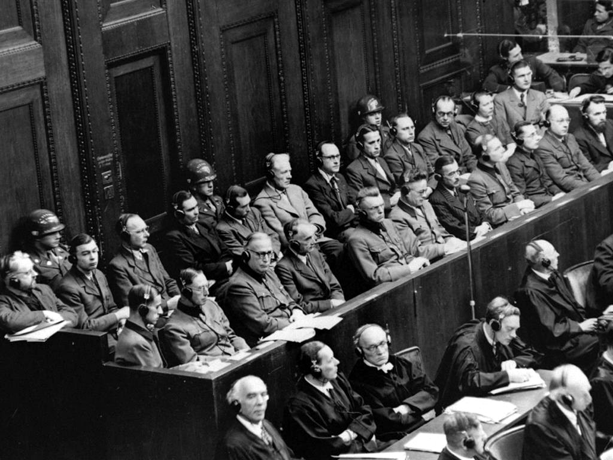
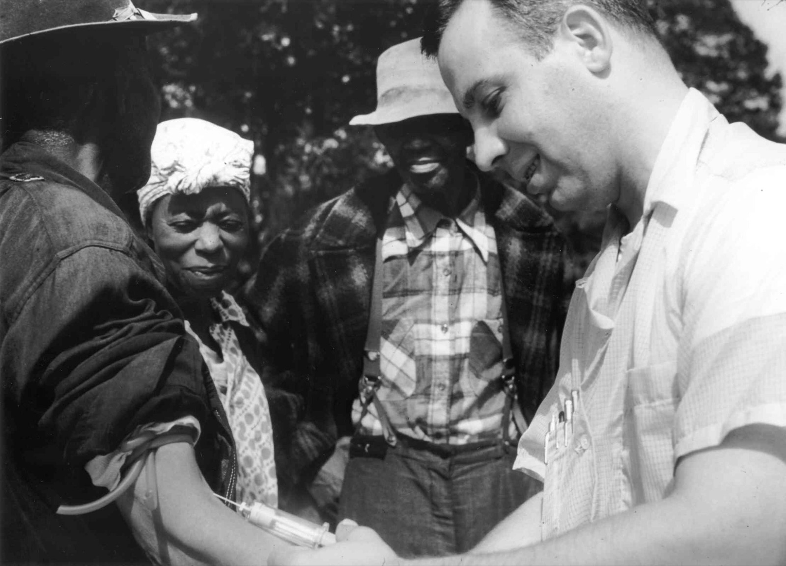
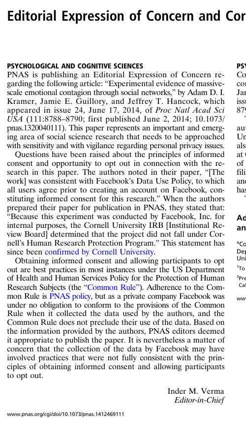
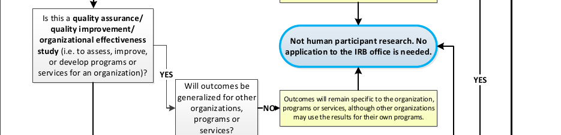
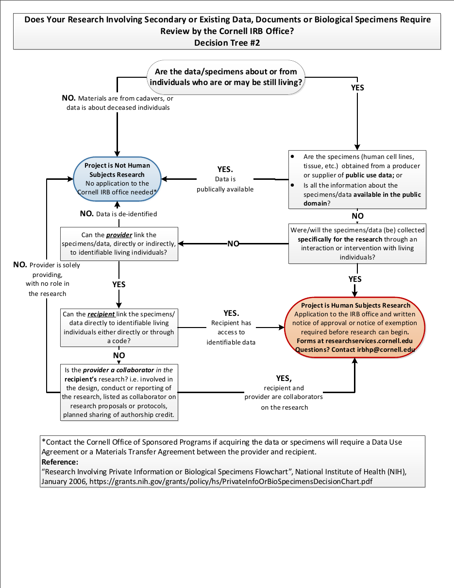
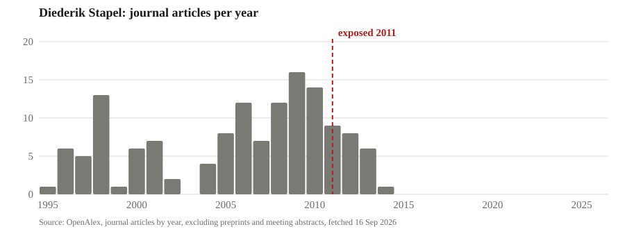
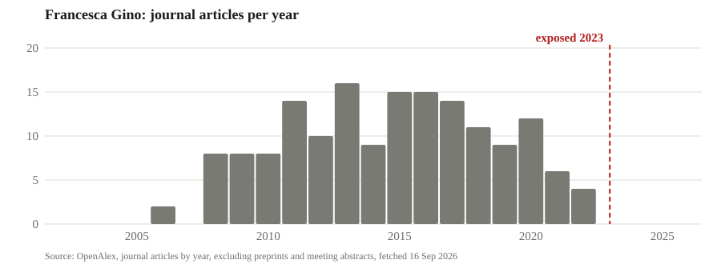
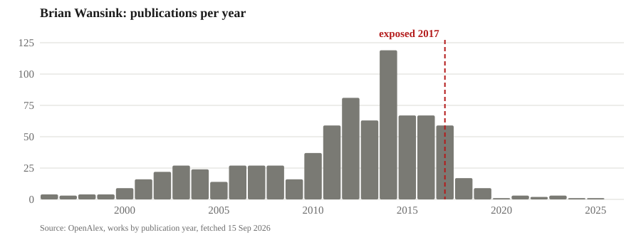
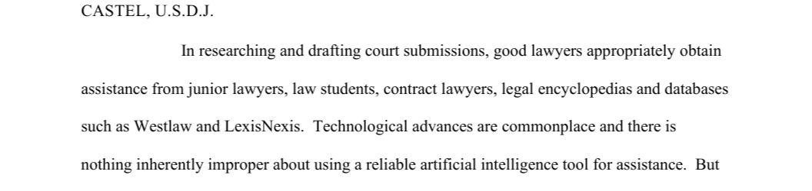
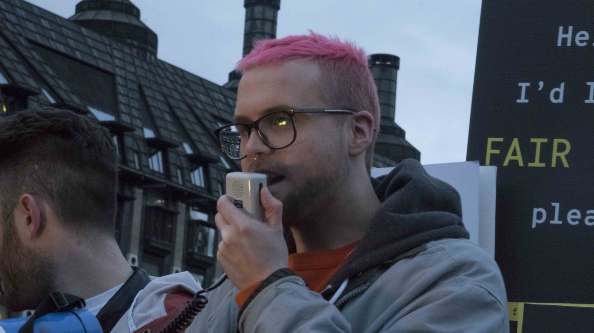

:::: {.content-hidden when-format="revealjs"}

::: {.callout-note appearance="simple"}
[**Open the slides**](04-ethics-slides.html)
:::

**What you should be able to do after this meeting.** Say whether your
project involves human participants, and defend the answer with the branch
of Cornell's decision tree it sits on. Say what p-hacking is, and what the
honest version of a three-specification analysis looks like. Say whether any
data source you named needs a data-use agreement or carries a licence, and
who signs.

::: {.callout-note title="What to take away" appearance="simple"}
A study is a question, the data and the methods. Two more things decide
whether it can happen and whether it survives: **ethical practice** and
**legal obligation**. They are different tests. The Tuskegee study ran for
forty years and nobody was ever prosecuted.

**Human subjects and the IRB.** The rules were written after specific
failures. They apply when you interact with people, or hold identifiable
information about them, and your results leave the course. Many projects in
this room do neither. Cornell's decision tree says which, and when in doubt
the IRB office decides, not you.

**Ethical research practices.** Fabrication, falsification and plagiarism
are misconduct. P-hacking, selective reporting and HARKing fall short of
misconduct and are far more common. Every case in the deck was caught by
outsiders, from the data file, after publication. A fabricated citation is a
fabrication, whoever or whatever produced it.

**Data-use agreements and licences.** A data-use agreement is a contract,
and the university signs it, not you. A licence and a website's terms of
service are contracts too. Nothing at moderate risk or above goes into a
public AI tool.

Session B decides which teams need an IRB application and which need a
data-use agreement. The teams whose project involves human participants
complete CITI training before meeting 6, because the IRB issues nothing
until every person on a protocol has finished.
:::

## Due

In session B, your project's IRB and DUA checklist, signed by every
member: does it need an IRB application, and does any data source need a
data-use agreement. If the answer to the first is yes, every member's CITI
human-participants training certificate on Canvas before meeting 6,
Wednesday September 30.

::::

:::: {.content-visible when-format="revealjs"}

## Motivation

- Our focus so far: research question, data, and methods.
- Critical aspects of your research also include:
  1. Ethical considerations: related to your study subjects, and the consumer of your research.
  2. Legal obligations: contracts, licence and regulations that govern what you can do with the data.
- You operate within pre-existing rules and norms; critical to understand them to avoid major issues.

::: {.notes}
Ninety seconds. Say it in the first person: three weeks on the question, the
data and the methods, and this week is the two things that are less
emphasised and end more projects.

Three topics, in the order of the two bullets. How you treat the people in
your data, and the board that checks. How you treat the people who read your
result. And what a contract, a licence or a website's terms let you do with
the data. Say now that many projects in this room involve no people at all,
and that the first topic is still theirs: the same rules govern every survey
and experiment they will run inside a firm.
:::

## Legal and ethical are different tests

::: {style="font-size:0.84em"}
- Legal is a floor set by somebody else: a regulation, a contract, a licence.
- Ethical is a judgement about people who cannot make it for you.
- The two come apart in both directions:
  - The Tuskegee study ran for forty years and nobody was ever prosecuted.
  - The Facebook experiment broke no law and drew an expression of concern.
  - Reporting one regression out of three breaks no law and has ended careers.
  - Scraping a public website is rarely a crime and frequently a breach.
- The National Academies tell institutions to go beyond simple compliance.
:::

[National Academies of Sciences, Engineering, and Medicine (2017), Fostering Integrity in Research, Recommendation Two](https://www.ncbi.nlm.nih.gov/books/NBK475939/){style="font-size:0.55em; color:#6b6b6b"}

::: {.notes}
Ninety seconds. Say the four cells out loud. Legal and ethical is most of
what you will do. Illegal and unethical needs no discussion. The two
off-diagonal cells are where the hour lives: legal but unethical, which is
Tuskegee, the Facebook study and p-hacking, and breach but defensible, which
is scraping public pages for a public-interest study.

Consequences are not the test either. Wansink resigned. The author who
supplied the fabricated insurance data for the 2012 honesty paper was
cleared by Duke and is still there. The test is what you would say to the
participants and to the reader if they could see everything you did.
:::

# 1. Human subjects and the IRB

## The Nuremberg Code

:::: {.columns}
::: {.column width="42%"}
{fig-align="center" width="100%"}

[The defendants in the dock at the Doctors' Trial, Nuremberg, 1946 to 1947. US Army photograph via USHMM, public domain.]{style="font-size:0.5em; color:#6b6b6b"}
:::
::: {.column width="58%"}
::: {style="font-size:0.64em"}
- From 1942, SS and Luftwaffe doctors ran experiments on concentration-camp prisoners at Dachau, Ravensbrück and Auschwitz: altitude, freezing, infected wounds, twins.
- Hundreds died or were harmed, and nobody asked the prisoners or told them what was being done.
- In December 1946 a US military tribunal at Nuremberg put 23 doctors and administrators on trial, convicted sixteen and hanged seven.
- In August 1947 the judges wrote ten rules for research on people into their judgment, and those rules are the Nuremberg Code.
- Rule one: "*The voluntary consent of the human subject is absolutely essential.*"
- Never adopted in full as law by any country, but absorbed into the Declaration of Helsinki in 1964 and into US consent rules.
:::
:::
::::

[USHMM, Holocaust Encyclopedia · Trials of War Criminals, vol. 2 (1949), via Yale's Avalon Project · Shuster (1997), NEJM 337:1436](https://avalon.law.yale.edu/imt/nurecode.asp){style="font-size:0.55em; color:#6b6b6b"}

::: {.notes}
Two minutes, and assume nobody in the room knows this. The museum's three
groups: experiments to keep German soldiers alive, trials of drugs and
treatments, and experiments in service of racial ideology. Dachau: prisoners
in a low-pressure chamber to simulate altitude and in ice water, to help
downed pilots. Ravensbrück: about 80 women, most of them Polish political
prisoners, had their legs cut open and infected to test a sulfa drug.

The question to ask from the front: which of these would still have been
wrong if nobody had been harmed? All of them, because the subjects could not
refuse. That is the sentence the judges wrote first.

The trial ran from December 9, 1946 to the judgment of August 19, 1947.
Seven acquitted, nine to prison, seven hanged at Landsberg in June 1948.
Mengele was never tried. The ten rules are on the companion page in full.
The federal regulations require exactly the first: legally effective
informed consent, free of coercion.
:::

## The Tuskegee syphilis study

:::: {.columns}
::: {.column width="42%"}
{fig-align="center" width="100%"}

[A doctor draws blood from a participant. National Archives, undated, public domain.]{style="font-size:0.5em; color:#6b6b6b"}
:::
::: {.column width="58%"}
::: {style="font-size:0.7em"}
- From 1932 to 1972 the US Public Health Service followed 600 Black men in Macon County, Alabama: 399 with syphilis and 201 without.
- The men were told they had "*bad blood*", were given free meals, transport and burial insurance, and were never told the diagnosis.
- Penicillin became the standard treatment in the 1940s, and the men were not treated and were kept from treatment.
- By one count, 128 of them died of syphilis or its complications, 40 wives were infected and 19 children were born with congenital syphilis.
- The study ended in 1972 after a Public Health Service employee gave the documents to the Associated Press, and nobody was ever prosecuted.
:::
:::
::::

[CDC, The Untreated Syphilis Study at Tuskegee, timeline · Heller, Associated Press, July 25, 1972 · Equal Justice Initiative](https://www.cdc.gov/tuskegee/about/timeline.html){style="font-size:0.55em; color:#6b6b6b"}

::: {.notes}
Two minutes. The study was designed to record the natural course of
untreated syphilis. The men thought they were in a government health
programme. They were given iron tonic, aspirin and placebo injections.

Peter Buxtun objected inside the Public Health Service from 1966 and was
rebuked. He gave the documents to the AP, and Jean Heller's story ran on
July 25, 1972. The study was stopped that November. At the start of 1972,
74 of the untreated men were still alive.

The question to ask from the front: in which year did the study become
wrong? Two good answers, and the room should find both. In 1932, because
the men were deceived and never consented. And in the late 1940s, when a
cure existed and was withheld so the study could continue. The Belmont
Report names the second one as the failure of justice.
:::

## The Belmont Report

::: {style="font-size:0.72em"}
- The National Research Act of 1974 created a national commission on research ethics and wrote the Institutional Review Board into law.
- The commission's Belmont Report of 1979 set out three principles, each with a practice:
  1. **Respect for persons**, applied as informed consent.
  2. **Beneficence**, applied as weighing risks against benefits and minimising harm.
  3. **Justice**, applied as choosing participants fairly, so the burden does not fall on the disadvantaged.
- The report names Tuskegee as the case where justice failed.
- An IRB applies the three principles before a study starts, and every university taking federal research money has one.
- No law requires a firm to apply the three principles to research it pays for itself: the federal rule reaches only federally funded or FDA-regulated research.
- What reaches the firm instead is privacy law, its own contracts, journals and the press, and none of them needs a board to act.
:::

[The Belmont Report, April 18, 1979 · Public Law 93-348 (1974) · 45 CFR 46.107](https://www.hhs.gov/ohrp/regulations-and-policy/belmont-report/index.html){style="font-size:0.55em; color:#6b6b6b"}

::: {.notes}
Two minutes. Belmont is the frame every review board applies. Read the
three principles as questions a board asks: did they agree, knowing what
they were agreeing to; is the risk worth it and as small as it can be; who
carries the risk and who gets the benefit.

The board's history in one breath. Committee review became a condition of
Public Health Service grants in 1966, the 1974 Act wrote the IRB into law
for those grants, the Common Rule was adopted across federal agencies in
1991 and revised in 2017. A board has at least five members, one of them a
non-scientist and one from outside the institution, and it approves before
a study starts. The federal rule reaches only research that is federally
funded or federally regulated. So a company's A/B test needs no board, drug
trials go through one because the FDA will not accept the data otherwise,
and tech companies built review panels after they were embarrassed.

The last two bullets are for the people in this room who will run research
inside a firm, which is most of them. Be precise: the three principles bind
a firm ethically, not legally. The Common Rule is a condition of federal
money, and the only research a company must put through a board whoever
pays is a drug or device trial, under FDA rules. What constrains a firm's
research on its own customers is privacy and consumer-protection law (the
FTC's five billion dollar Facebook penalty, GDPR, the UK regulator in the
Royal Free case), the contracts it signed, the journals it wants to publish
in, and the press. AOL posted 20 million search queries for researchers in
2006; a reporter identified a user by name within days, the chief
technology officer resigned and two employees were fired. Nobody at AOL
needed an IRB to lose those jobs. Three habits travel anywhere: ask people
where you can, collect the minimum, and have somebody with no stake read
the plan.
:::

## The Facebook experiment of 2014

:::: {.columns}
::: {.column width="62%"}
::: {style="font-size:0.66em"}
- For one week in January 2012, Facebook changed the News Feeds of 689,003 users, removing some positive posts for one group and some negative posts for another.
- It measured whether the users' own posts turned more positive or negative, and they did, by about a tenth of a percentage point.
- Consent, in the paper's words: the Data Use Policy "*to which all users agree prior to creating an account on Facebook*".
- Two authors were at Cornell, and Cornell's IRB ruled that they only saw results and were not engaged in human research.
- PNAS published it in June 2014 and printed an expression of concern in July.
- The concern: a private company is under no obligation to follow the federal rule, so the paper stands, but the study may have fallen short of informed consent and the chance to opt out.
- Facebook's answer in October 2014 was an internal review panel and a research website, not an IRB.
:::
:::
::: {.column width="38%"}
{fig-align="center" height="400"}

[PNAS, Editorial Expression of Concern, July 22, 2014.]{style="font-size:0.5em; color:#6b6b6b"}
:::
::::

[Kramer, Guillory and Hancock (2014) · Verma (2014) · Cornell statement, June 30, 2014 · Facebook Newsroom, October 2, 2014](https://doi.org/10.1073/pnas.1320040111){style="font-size:0.55em; color:#6b6b6b"}

::: {.notes}
Two minutes. Give the room the whole story, because most of them were in
school when it happened.

The experiment: for a week, some users saw fewer of their friends' positive
posts and others fewer negative ones. The measure was the words in their
own status updates, classified by software. The effect was tiny and real.
The consent was a clause in the data-use policy, and the paper said so.

The reaction came at the end of June, weeks after the paper went online: an
apology from the Facebook author, and PNAS's expression of concern, which
is the page on the slide. Walk the editor's reasoning in order, because the
room will hear a contradiction otherwise. The journal's own policy is that
its papers follow the federal rule, which treats consent and the chance to
opt out as best practice. Facebook is a private company, so it was under no
obligation to follow that rule when it collected the data. So the paper
stands. And the editor nevertheless put on record that the collection may
not have been consistent with consent and opting out. Cornell said its
professor and his graduate student had access only to results, so its
board never reviewed it. Facebook announced review guidelines and a panel
that October.

Nothing illegal happened. That is why it is here.
:::

## What is different between the Facebook experiment and an ordinary A/B test?

- Facebook runs tests on its feed every day, and nobody calls them research.
- The 2014 study was designed as a study, run by scientists, and published in a journal.
- Both change what people see without telling them.

::: {.notes}
Three minutes. The room talks first, then two or three answers, then the
answer told.

The answer. It was designed to produce generalisable knowledge and it was
published, which is the federal definition of research. So the ethics rules
applied to it and they do not apply to an ordinary A/B test. The terms of
service are not informed consent, which is why PNAS issued an expression of
concern. The Cornell angle is the existing-data page of the tree, a few
slides from now, working: the Cornell authors only saw results.

The point to land: the definition turns on the intent to generalise, not on
whether anybody was hurt. A capstone is written to say something general,
or it is written for one firm. That choice decides which rules apply.
:::

## Two questions decide whether the IRB applies

::: {style="font-size:0.76em"}
1. Is it **research**: a systematic investigation designed to produce generalisable knowledge?
2. Are there **human participants**: you interact with people, or you hold identifiable private information about them?

- Examples that count:
  - A survey, an interview or an experiment you run yourself.
  - Scraped posts or reviews where individuals are identifiable.
  - Purchased consumer records with names or addresses.
- Examples that do not:
  - Firm financials, prices, trade flows or weather.
  - Foot-traffic data that arrives aggregated and de-identified.
- Both answers have to be yes, and many projects in this room answer no to the second.
- Identifiable rows count even if you never meet anybody.
:::

[45 CFR 46.102, the definitions in the Common Rule](https://www.ecfr.gov/current/title-45/subtitle-A/subchapter-A/part-46){style="font-size:0.55em; color:#6b6b6b"}

::: {.notes}
Two minutes. Both questions have to be yes for the IRB to apply. The first
is the one the Facebook discussion just answered. The second is the one
teams get wrong in both directions. Some hear "human participants" and
think only of a survey, and miss that a purchased file with names is the
same thing. Others assume that a course on research means a protocol for
everyone, and it does not: a team on firm financials or weather has no
human participants and nothing to file. Say the second half as plainly as
the first.
:::

## Class projects and one-organisation studies

{fig-align="center" width="66%" .nostretch}

::: {style="font-size:0.74em"}
- The tree's first question is whether the sole intent of a class project is to meet the course requirement, and a capstone whose results leave the course is research.
- The branch above is quality improvement: a study whose outcomes stay with one organisation is not human participant research, and that is last week's private value.
- Written to say something about people in general, the same project is research, and the choice is made before the data is collected.
- When in doubt you ask irbhp@cornell.edu, because you do not make the call.
:::

[Cornell IRB office, Does your project require an application to the Cornell IRB office? Decision tree 1, the class-project row and the quality-improvement branch](https://researchservices.cornell.edu/sites/default/files/2019-05/IRB%20Decision%20Tree.pdf){style="font-size:0.55em; color:#6b6b6b"}

::: {.notes}
Two and a half minutes. The two crops are from the instrument the IRB
office's own staff use, and it is public. The full tree is linked from the
companion page.

The class-project row, in the tree's own words: "Is the sole intent of the
project to meet course requirements, with no intention to use the results
for something other than the course assignment?" If yes, not human
participant research. A capstone whose plan is executed in AEM 6992 and
presented to a room, or handed to a sponsor, is outside the course. So the
class-project row does not rescue you. Say that before anybody hopes it
does.

The quality-improvement branch is the private-value project from meeting 3
in the IRB office's own words, and it is the branch the finance and
marketing teams are on. A study whose outcomes stay with one firm needs no
application. The moment the same project is written to say something about
people in general, it is research. Teams can choose which of these they
are, and the choice has to be made before the data is collected.

Research inside a company follows the same lines. Done for the firm's own
decisions, it is quality improvement and no rule requires a board. Meant
for outside, it is research. And a firm with no board is not a firm with no
ethics, which is the Belmont slide's last bullet.
:::

## Existing data has its own tree

:::: {.columns}
::: {.column width="44%"}
{fig-align="center" height="470"}
:::
::: {.column width="56%"}
::: {style="font-size:0.74em"}
- Page two of the same document, for data somebody else collected.
- Are the rows about people who may still be living?
- Is the file publicly available?
- Can you link a row to a living person, directly or through a code?
- If you cannot, and the provider is not your collaborator, it is not human participant research.
- What the vendor calls the file is not one of the questions.
:::
:::
::::

[Cornell IRB office, decision tree 2, research involving secondary or existing data](https://researchservices.cornell.edu/sites/default/files/2019-05/IRB%20Decision%20Tree.pdf){style="font-size:0.55em; color:#6b6b6b"}

::: {.notes}
Ninety seconds. This is the page for most of the projects in this room,
because most of them run on data somebody else collected. Walk it. Living
people, or it is out. Publicly available, and it is out. Not public: can
you, the recipient, link a row to a person, directly or through a code the
provider holds? If not, and the provider is just providing, it is not human
participant research.

The last bullet is the one to say twice. The tree asks what you can do with
the rows. It does not ask what the vendor wrote on the invoice.
:::

## Removing the names is not de-identification

::: {style="font-size:0.84em"}
- ZIP code, birth date and sex together identify 87 percent of Americans uniquely.
- In 1997 a graduate student, Latanya Sweeney, joined a "de-identified" hospital file to the voter roll on those three fields and mailed the governor of Massachusetts his own records.
- Netflix released anonymised movie ratings and two researchers matched them to named IMDb reviewers.
- New York released taxi trips with hashed medallion numbers and the hashes were reversed in hours.
- Direct identifiers are the easy part and quasi-identifiers are the file.
:::

[Sweeney (2000), Simple demographics often identify people uniquely · Narayanan and Shmatikov (2008), IEEE S&P · Pandurangan (2014), Of taxis and rainbows](https://dataprivacylab.org/projects/identifiability/paper1.pdf){style="font-size:0.55em; color:#6b6b6b"}

::: {.notes}
Two minutes. Three stories, and each one is a file somebody in this room
would happily download.

Sweeney, 1997: a computer science graduate student at MIT, now a professor
at Harvard. Massachusetts released hospital discharge records with names
removed but ZIP, birth date and sex kept. She bought the Cambridge voter
roll for twenty dollars, joined on those three fields, and mailed Governor
Weld his own records. The 87 percent is from her 2000 paper; a later
re-estimate on 2000 census data put it nearer 63 percent, which changes
nothing. Netflix, 2006: half a million
users' ratings, names replaced by numbers, released for a prize; a handful
of dated ratings matched to public IMDb reviews identified people. New York,
2014: a year of taxi trips with medallion numbers hashed; the hash was a
standard one over a small set of possible numbers, so a developer reversed
every hash in a few hours.

This is why the tree asks what you can do with the rows and not what the
vendor calls the file.
:::

## Which of these needs an application?

- An online experiment on a nutrition label with three hundred paid participants, results to your proposal.
- Foot-traffic data from Dewey, aggregated and de-identified before you see it.
- Glassdoor reviews scraped with usernames, to say something about employers in general.
- Firm financials from Compustat.
- A vendor's consumer file sold as de-identified, with ZIP code, birth year and sex on every row.

::: {.notes}
Three minutes. A short silent write on the strip, then told.

The first, the third and the fifth. The experiment interacts with people
and its results leave the course. The scrape is passive observation of
public behaviour online, which the tree lists by name, and the rows are
identifiable. It goes to the office, it will probably come back exempt, and
the office says so, not you. The scrape also trips a second gate, terms of
service, which is the third part of the hour. The vendor file: the tree asks
whether you can link a row to a living person, and the previous slide says
that you can. So it goes to the office, whose likely answer is that it is
exempt, or not human research once the fields are coarsened. The honest
version is the same project on three-digit ZIP and five-year age bands, or
on the vendor's own aggregates, decided before the file is opened.

Dewey arrives aggregated and de-identified, which is the existing-data tree
saying no. Compustat is not about individuals at all. Two of the five need
nothing, and that is the point of the slide.
:::

## Three levels of review measured in weeks

::: {style="font-size:0.84em"}
1. An **exemption** takes three to four weeks from start to finish at Cornell.
2. **Expedited** review takes four to six.
3. The **full board** takes four to eight and meets on the first Friday of the month.

- You do not decide that you are exempt: the IRB issues that determination.
- A student protocol needs a faculty advisor who answers for it, and in this course that is me.
:::

[Cornell IRB, the life cycle of an IRB protocol · IRB FAQs · PI eligibility](https://researchservices.cornell.edu/resources/life-cycle-irb-protocol){style="font-size:0.55em; color:#6b6b6b"}

::: {.notes}
Ninety seconds, and only for the teams that answered yes. The weeks are
Cornell's own, from the IRB office's page on the life cycle of a protocol,
and they assume a complete submission. An incomplete one goes back and the
clock restarts. The full board's clock is a calendar, not a queue.

A student cannot usually be the principal investigator. A protocol needs a
faculty advisor who takes responsibility for compliance, and for this
course that is me. So the draft goes past me before it goes to the IRB, and
the instrument and the consent language come to office hours first. Boards
differ on what they call exempt and on turnaround, and a partner at another
university means a second review.
:::

## CITI training for projects with human participants

- Every person named on a protocol completes CITI human-participants training, exempt protocols included.
- The IRB issues nothing until the last name on the protocol has finished.
- The course takes two to four hours online, and the certificate lasts five years.
- If your project involves human participants, every member's certificate goes on Canvas before meeting 6, Wednesday September 30.
- If it does not, you do it the week the plan changes, and the credential is worth having for the research you will run inside a firm.

[Cornell IRB training · IRB news, October 2022: training required for exempt research](https://researchservices.cornell.edu/resources/irb-training){style="font-size:0.55em; color:#6b6b6b"}

::: {.notes}
Ninety seconds, and this is the homework, so it has to be said in the
room. Session B decides who it applies to: a team whose sheet says yes or
ask on the IRB question does it now, and a team that says no does not.

Say the mechanism once, in the syllabus's words. Register at citiprogram.org
under the Cornell affiliation. Take the course Cornell accepts, which is
called IRB Training or IRB Basic. Download the completion certificate and
upload it to the Canvas assignment by Wednesday September 30 at 11:59 pm.
For the teams it applies to, not there by then costs five participation
points. For everyone else, say plainly that it is two to four hours for a
credential that lasts five years, and leave it there.
:::

# 2. Ethical research practices

## The case of Diederik Stapel

::: {style="font-size:0.72em"}
- A social psychologist at Tilburg who, for years, invented the data behind his own papers and his students' dissertations.
- Three junior researchers in his department noticed the data were too clean and reported him in August 2011.
- The university's inquiry found fraud in 55 publications and parts of 10 doctoral dissertations, and Retraction Watch counts 58 retractions.
- He was suspended, then dismissed, and gave back his doctorate.
:::

{fig-align="center" width="66%" .nostretch}

[Levelt, Noort and Drenth committees (2012), Flawed Science · Retraction Watch leaderboard · OpenAlex](https://www.tilburguniversity.edu/sites/default/files/download/Final%20report%20Flawed%20Science_2.pdf){style="font-size:0.55em; color:#6b6b6b"}

::: {.notes}
Two minutes. Lead the section with the cleanest case: he made up the
numbers, and the people who caught him were the most junior people in the
building.

The chart is journal articles per year from OpenAlex, with the year the
case broke marked, and it excludes preprints, datasets and the
conference-meeting abstracts that journals print in supplements. It is the
shape of every case in this section: a career that stops. Google Scholar
keeps counting citations to retracted papers, which is why the deck shows
output rather than citations.
:::

## Three words cover research misconduct

::: {style="font-size:0.88em"}
1. **Fabrication** is making up data or results.
2. **Falsification** is changing or omitting data or results so that the record misrepresents the research.
3. **Plagiarism** is presenting somebody else's ideas, processes, results or words as your own.

- A finding requires a significant departure from accepted practice, done intentionally, knowingly or recklessly.
- Honest error and differences of opinion are not misconduct.
- A citation that does not exist is a fabrication, whoever or whatever produced it.
:::

[42 CFR Part 93, the federal definition of research misconduct and the requirements for a finding](https://www.ecfr.gov/current/title-42/chapter-I/subchapter-H/part-93){style="font-size:0.55em; color:#6b6b6b"}

::: {.notes}
Ninety seconds. The federal definition, one line each. It is short on
purpose. The first bullet under the list is the standard a committee has to
meet, and the second is why an honest spreadsheet error, which next week's
Reinhart and Rogoff case is, is not misconduct. The last bullet comes back
on the lawyers' slide.
:::

## Cornell's Code of Academic Integrity

::: {style="font-size:0.68em"}
- Every Cornell student is bound by the Code, and a new version took effect on August 24, 2026.
- Its principle: "*Absolute integrity is expected of every Cornell student in all academic undertakings.*"
- Submitting work for credit says it is your own and that all outside assistance is acknowledged.
- Violations it names:
  - Knowingly representing the work of others as one's own.
  - Unauthorized assistance: any aid not explicitly permitted by the instructor, including "*by artificial intelligence*".
  - "*Citing fabricated or non-existent sources, including false citations generated by artificial intelligence.*"
  - Fabricating data, and misrepresenting one's academic accomplishments.
- The instructor hears a case first, the college's board hears appeals, and penalties run from a failing grade to expulsion.
- This course's written variance, in the syllabus: AI is permitted and disclosed, and a fabricated citation is still a fabrication.
:::

[Cornell University, Code of Academic Integrity, effective August 24, 2026 · AEM 6991 syllabus, AI policy](https://deanoffaculty.cornell.edu/faculty-and-academic-affairs/academic-integrity/upcoming-code-of-academic-integrity/){style="font-size:0.55em; color:#6b6b6b"}

::: {.notes}
Two minutes. The previous slide is the federal definition, for research.
This one is the rule you are actually bound by today, as students, and it
covers everything you hand in for this course and for AEM 6992.

The Code was revised this year and the new text took effect on August 24,
2026, three weeks ago. Two additions matter here, and both are on the
slide in the Code's own words: unauthorized assistance now names
artificial intelligence, and citing a fabricated or non-existent source,
including one an AI generated, is a listed violation. "Students are
responsible for the accuracy and existence of all sources they cite,
regardless of how those sources were generated or obtained."

The Code lets an instructor vary it in writing at the start of the course,
and the syllabus does: AI is permitted by default, every deliverable
carries a disclosure block, and failure to disclose is a violation. The
variance changes what counts as authorized assistance. It does not touch
the fabricated-citation rule, which is why the lawyers' slide is two
slides away.

Process, briefly: a primary hearing with the instructor, a student and an
independent witness; the college's board on appeal; findings recorded in a
central registry; expunged if not guilty.
:::

## The case of Francesca Gino

::: {.columns}
::: {.column width="50%"}
::: {style="font-size:0.7em"}
- A Harvard Business School professor whose work on honesty and creativity was among the most cited in the field.
- In June 2023 three bloggers showed, from metadata inside an Excel file, that rows had been moved between conditions in one study, and raised the same alarm on three more papers.
- Harvard's investigation found multiple instances of research misconduct and put her on unpaid leave, and she sued Harvard and the bloggers for 25 million dollars.
- The defamation claims were dismissed in 2024, and Harvard revoked her tenure in May 2025, a first in decades.
:::
:::
::: {.column width="50%"}
{fig-align="center" width="100%"}
:::
:::

[Data Colada 109 and 118 · The Harvard Crimson, September 12, 2024 · Inside Higher Ed, May 27, 2025 · OpenAlex](https://datacolada.org/109){style="font-size:0.55em; color:#6b6b6b"}

::: {.notes}
Ninety seconds. Falsification, in the definition's second word: nothing
invented, rows moved. The detection method is the teaching point: Excel
keeps a calculation chain inside the file, and the order of that chain
showed that six rows had been moved between conditions after the data were
entered. A forensics firm later found 168 altered observations in another
study, all in the direction of the hypothesis.

Every cell on this slide is a retraction notice, a court ruling or Harvard's
own action. Say nothing the sources do not.
:::

## Detrimental practices that fall short of misconduct

::: {style="font-size:0.66em"}
- The data are real and the search is undisclosed, so the federal definition does not reach them.
- The line is intent: omit results knowingly so that the record misrepresents the research and it is falsification.
- **p-hacking**: trying specifications, samples or measures until a result clears the line.
- **HARKing**: presenting a result found after the fact as the hypothesis you started with.
- **Selective reporting**: publishing the studies and measures that worked and dropping the rest.
- **Undisclosed data cleaning**: dropping outliers or rows without a stated rule, always in the same direction.
- **Not keeping the data and code**, so nobody can check the result, one of Cornell's four findings against Wansink.
- **Gift, ghost and coerced authorship**, and leaving out people who earned it.
- In a 2012 survey of 2,155 psychologists, 46 percent admitted selective reporting and 27 percent admitted HARKing.
- The National Academies call the family detrimental research practices, and say the damage might surpass misconduct's.
:::

[NASEM (2017), Fostering Integrity in Research, chapter 4 · John, Loewenstein and Prelec (2012), Psychological Science 23:524 · 42 CFR 93.103](https://www.ncbi.nlm.nih.gov/books/NBK475954/){style="font-size:0.55em; color:#6b6b6b"}

::: {.notes}
Two and a half minutes. The three words are the crimes. This slide is the
misdemeanours, and they are far more common.

Why they fall short, in the definition's own terms. A finding of
misconduct needs a significant departure from accepted practice, done
intentionally, knowingly or recklessly. These practices leave the data
intact and the regressions real; what is missing is disclosure of the
search. And they are common enough to be accepted practice in many fields,
which defeats the first element, and that is the perverse part. The
boundary is intent: falsification includes omitting results so that the
record misrepresents the research, so selective reporting done knowingly
to mislead is falsification. Cornell's finding against Wansink was
"misreporting of research data", and that is the slide after next.

The source for the label is the National Academies' 2017 report, chapter
4, which replaced "questionable research practices" with "detrimental
research practices" and lists misleading statistical analysis short of
falsification, failure to retain or share data and code, authorship abuses,
neglectful supervision and abusive editorial practices. The named practices
and the survey figures are John, Loewenstein and Prelec: the figures are
control-group self-admission rates with no incentive for honesty, and the
group given an incentive admitted more, so these are floors. Duplicate
publication and self-plagiarism belong on the list too, as journal-policy
violations rather than federal misconduct, since plagiarism in the
definition is taking another person's work.

The point for March: none of these requires inventing a number. They only
require not writing down what you did. And none of them needs a human
participant: a team on firm financials can p-hack as easily as a team on a
survey.
:::

## The case of Brian Wansink

::: {.columns}
::: {.column width="50%"}
::: {style="font-size:0.68em"}
- Cornell's Food and Brand Lab, in this school, published hundreds of papers on eating behaviour.
- In November 2016 he wrote a blog post describing how a student re-analysed a null result until four papers came out of it.
- Three researchers found about 150 statistical inconsistencies in those four papers from the reported numbers alone.
- In September 2018 the JAMA journals retracted six papers after Cornell told them it could not vouch for the results.
- Cornell's committee found academic misconduct: misreporting of data, problematic statistics, failure to keep records and inappropriate authorship.
- He resigned, with eighteen retractions.
:::
:::
::: {.column width="50%"}
{fig-align="center" width="100%"}
:::
:::

[van der Zee, Anaya and Brown (2017) · Retraction Watch, September 19, 2018 · Cornell Chronicle, September 20, 2018 · OpenAlex](https://news.cornell.edu/stories/2018/09/provost-issues-statement-wansink-academic-misconduct-investigation){style="font-size:0.55em; color:#6b6b6b"}

::: {.notes}
Two minutes. This one happened in this building, and it is the case closest
to what this room will actually be tempted to do. Nothing was invented. A
dataset that showed nothing was sliced until it showed something, four
times, and the blog post said so proudly. That is the previous slide's
first bullet, and it ended as a misconduct finding.

The inconsistencies were found from the published tables alone: sample
sizes that could not produce the reported means, degrees of freedom larger
than the sample. Then Cornell's committee, the provost's statement of
September 20, 2018, and retirement at the end of that academic year.
:::

## How misconduct gets caught

::: {style="font-size:0.6em"}
| Case | What was wrong | Who caught it and how | The price |
|:--|:--|:--|:--|
| Stapel, 2011 | Invented the data for dozens of papers | Three junior researchers in his own department reported him | His chair, his doctorate and 58 papers |
| LaCour, 2015 | A survey that was never run | Two graduate students tried to replicate it and found the survey firm had no record | The paper and a job offer |
| Wansink, 2017 | Null results re-analysed until they were papers | Three outside researchers found 150 inconsistencies in the reported statistics | His position and 18 papers |
| The 2012 honesty-pledge paper, 2021 | Fabricated rows in an insurance field experiment | Three bloggers found two fonts in one column | The paper |
| Gino, 2023 | Altered rows in four papers | The same bloggers read the metadata inside an Excel file | Tenure at Harvard, revoked in 2025 |
:::

::: {style="font-size:0.72em"}
- Caught by outsiders or juniors, from the file or the reported numbers, after publication.
- So keep the raw file, one path from raw to result, and a note saying where the raw came from.
:::

[Sources for each row are in the companion page's table of cases](04-ethics.html#the-cases-in-full){style="font-size:0.55em; color:#6b6b6b"}

::: {.notes}
Two minutes. Read the third column down, not the rows across. Nobody in
this table was caught by a reviewer or an editor. They were caught by
people with no stake, who asked for the file, opened it, and looked.

LaCour: a 2014 paper in Science claimed that one conversation with a gay
canvasser changed voters' minds for months; two graduate students who
wanted to extend it found the survey firm had no record of the study, and
LaCour never produced the data. The honesty-pledge paper: a 2012 PNAS field
experiment with an insurer; in 2021 the bloggers showed the insurance data
were fabricated, and who fabricated them is not established, so say nothing
about who did it.

The reproducibility habits of next week are what lets an honest researcher
show the file and be believed.
:::

## "*It was the AI's fault*" is not an excuse

::: {style="font-size:0.7em"}
- In 2023 two New York lawyers filed a brief citing six court opinions that did not exist.
- An AI assistant, ChatGPT, had invented them, with plausible names, courts and citations.
- Judge Castel fined the lawyers and their firm 5,000 dollars, and made them write to every judge falsely named as the author of an opinion.
- The judge wrote that "*there is nothing inherently improper about using a reliable artificial intelligence tool for assistance*", so the fault was not checking.
- The syllabus says the same thing: undisclosed AI use and a fabricated citation are both integrity violations.
:::

{fig-align="center" width="64%" .nostretch}

[Mata v. Avianca, Inc., No. 22-cv-1461 (S.D.N.Y. June 22, 2023), opinion and order on sanctions, from page 1](https://caselaw.findlaw.com/court/us-dis-crt-sd-new-yor/2335142.html){style="font-size:0.55em; color:#6b6b6b"}

::: {.notes}
Ninety seconds. The case that is live in this room. A personal-injury suit
against an airline. One lawyer asked ChatGPT for precedents, got six, and
his colleague filed them. Opposing counsel could not find them. The judge
could not find them. The court found bad faith in the "conscious avoidance
and false and misleading statements" that followed, not in the use of the
tool. The image is the first page of the sanctions order, with the sentence
on the slide in it.

Next week you learn how assistants produce these, and why a DOI that
resolves to a different paper is the tell.
:::

## Is reporting one specification out of three misconduct?

- A team runs three specifications and reports the one that worked.
- Is it fabrication, falsification, plagiarism or none of them, and what is the honest version?

::: {.notes}
Three minutes. The room talks, then told.

It is not fabrication or falsification under the definition. Nothing was
invented and nothing was changed. It is selective reporting, from the
detrimental-practices slide, and it is the practice most of the retracted
social science of the last decade was built on, because reporting the
survivor of many tries presents a fluke as a finding.

The honest versions are two. Report all three and say why they differ. Or
write the specification down before you run it, which is what
pre-registration is, and the December proposal is where you do that. In
March every team in this room will have three specifications and one of
them will look better.
:::

# 3. Data-use agreements and licences

## The Cambridge Analytica case

:::: {.columns}
::: {.column width="60%"}
::: {style="font-size:0.6em"}
- Cambridge Analytica was a British political consulting firm that sold voter targeting by personality and worked for the 2016 Trump campaign.
- In 2014 a Cambridge University psychologist's quiz app, presented as research, was installed by about 270,000 people and, as Facebook then allowed, took their friends' data too: up to 87 million profiles.
- He passed the data to Cambridge Analytica against Facebook's platform policy, and the firm built voter profiles from it.
- Facebook learned of the transfer in 2015, asked for the data to be deleted and took certificates that it had been, and it had not.
- In March 2018 a former employee, Christopher Wylie, told the Observer and the New York Times.
- The price: a 500,000 pound UK fine, the legal maximum; a 5 billion dollar FTC penalty; the chief executive before Congress; the firm closed within two months.
- The quiz-takers agreed to something, and their friends agreed to nothing.
:::
:::
::: {.column width="40%"}
{fig-align="center" width="100%"}

[Christopher Wylie at the protest in Parliament Square, London, March 29, 2018. Photo John Lubbock, CC BY-SA 4.0.]{style="font-size:0.5em; color:#6b6b6b"}
:::
::::

[The Observer, March 17, 2018 · Facebook Newsroom, March 16 and April 4, 2018 · ICO, October 25, 2018 · FTC, July 24, 2019](https://about.fb.com/news/2018/04/restricting-data-access/){style="font-size:0.55em; color:#6b6b6b"}

::: {.notes}
Two and a half minutes, and tell the whole arc, because most of the room
was in high school in 2018. A political consulting firm, funded by Robert
Mercer with Steve Bannon on its board, claimed it could target voters by
personality. It got its raw material from a Cambridge academic's
personality quiz, built in 2014 under a research framing, which harvested
the quiz-takers' friends through the permissions Facebook then granted to
apps. The firm worked for the Cruz and then the Trump campaigns in 2016.
Facebook was told in December 2015, demanded deletion and accepted
certifications. In March 2018 Christopher Wylie, who had helped build the
operation, went to the Observer and the New York Times with the documents.
Facebook lost about a hundred billion dollars of market value in a week,
Zuckerberg testified in April, the firm was in insolvency by May, and the
regulators' penalties followed over the next eighteen months.

It opens the third part because it is a data-agreement failure from end to
end. Data collected under one purpose, research, and passed to a third
party against the platform's terms. A certificate of deletion that was
false. And a price paid by the platform, the firm and the developer.

Facebook says collecting under a research framing was within its rules; the
FTC later alleged the app lied to users about what it took. The FTC's own
words: Facebook "did not screen the developers or their apps before
granting them access to vast amounts of user data." The FTC also sued
Cambridge Analytica and settled with the app developer and the former chief
executive, who must delete everything derived from the data.

The lesson for this room is the next slide's bullet: a data agreement fixes
the purpose, the recipients and the exit, and every case on the next slide
broke one of the three.
:::

## When data is used beyond what was agreed

::: {style="font-size:0.6em"}
| Case | What was agreed | What happened | The price |
|:--|:--|:--|:--|
| Havasupai, 1990 to 2010 | Blood given by tribe members for diabetes research | Used in studies of schizophrenia, migration and inbreeding, found out at a dissertation defence in 2003 | The Board of Regents settled in 2010: 700,000 dollars, the samples returned, an apology |
| Royal Free and DeepMind, 2015 to 2017 | Nothing that told the patients | A London hospital trust gave Google DeepMind the records of 1.6 million patients to build an app | The UK regulator ruled in 2017 that the trust had broken data protection law |
| AOL, 2006 | No agreement at all | Twenty million queries from 658,000 users posted for researchers, and the New York Times identified user 4417749 by name | The chief technology officer resigned and two employees were fired |
:::

::: {style="font-size:0.8em"}
- The harm came from use beyond the stated purpose, and a data-use agreement fixes the purpose, the recipients and the exit.
:::

[Embryo Project Encyclopedia, Havasupai Tribe v. Arizona Board of Regents · ICO, July 3, 2017 · World Privacy Forum, August 8, 2006](https://embryo.asu.edu/pages/havasupai-tribe-v-arizona-board-regents-2008){style="font-size:0.55em; color:#6b6b6b"}

::: {.notes}
Two minutes, one case at a time, and the bullet under the table is the
lesson. Havasupai is the case to tell in most detail: the consent form said
"the causes of behavioral/medical disorders", the tribe understood
diabetes, and the samples fed 23 papers and dissertations, 15 of them on
something else. The tribe sued in 2004; the Board of Regents settled in
April 2010, with the blood returned.

Royal Free is the one for anybody planning to work with a firm's customer
records: the transfer itself was the breach, because nobody told the
patients. AOL is the one for anybody who thinks a research release is
harmless because the users are numbers.
:::

## A data-use agreement is a contract

::: {style="font-size:0.84em"}
- It is not an ethics review and it does not replace one.
- The university signs it, through the Office of Sponsored Programs, not you.
- Expect legal review on both sides and expect months.
- It binds Cornell, and it binds you through Cornell, so a breach is the university's problem and then yours.
- OSP is asked at osp_dua@cornell.edu, and whether it will sign for a class project is a question to ask in October, not assume.
:::

[Cornell Research Services, exchange commercially unavailable or restricted data](https://researchservices.cornell.edu/resources/exchange-commercially-unavailablerestricted-data){style="font-size:0.55em; color:#6b6b6b"}

::: {.notes}
Two minutes. A different kind of thing from the IRB, and it applies to a
different set of teams: anybody whose data is held by a firm or an agency
and is not simply downloadable.

A data-use agreement governs somebody else's proprietary data. It is
negotiated by lawyers on both sides. At Cornell the Office of Sponsored
Programs is the party that enters into agreements for the use of data. You
are not a party. You cannot accept a firm's terms on the team's behalf,
however reasonable they look.

Is it legally binding? Yes. It binds the university, and you are bound
through the university, so a breach is a matter between the firm and
Cornell first and between Cornell and you second. A team that finds out in
February that it needs one has lost the semester it was going to run the
study in. That is why this meeting is in September.
:::

## What the clauses do

::: {style="font-size:0.8em"}
- Publication review is normal and a veto is not, so settle it before anybody signs.
- Destruction at the end, no redistribution, and no attempt to re-identify are standard.
- The agreement names who may touch the file and where it may live.
- A teammate's employer may offer data under a non-disclosure agreement, and an NDA that covers the result blocks the presentation in this room in December.
- Settle who owns the output before the file arrives.
- A conflict of interest is disclosed rather than confessed: one sentence that tells the reader how to weight your claim.
:::

[Cornell Research Services, exchange restricted data](https://researchservices.cornell.edu/resources/exchange-commercially-unavailablerestricted-data){style="font-size:0.55em; color:#6b6b6b"}

::: {.notes}
Two minutes. Read the clauses as things that will happen to your project.

Publication review means the firm sees the write-up before it goes out and
can ask for its confidential figures to be removed. A veto means the firm
can stop the write-up. Review is normal. A veto means you may not be able
to show your own result, and it is settled before signing or the project
has no result.

Several of you have a former or current employer who would hand over data.
Good. Three clauses to settle before it arrives: the NDA, ownership, and
the review clause. And the conflict, which is disclosed on the title page
in one sentence.
:::

## Licences on data Cornell already holds

::: {style="font-size:0.84em"}
- A licence is a contract too, and the university accepted it so that you can have an account.
- Most of what the library pays for, WRDS and Compustat included, is licensed for academic non-commercial use.
- A project a firm would pay for cannot be built on a licence that forbids commercial use.
- The terms decide what you may publish and whether you may pass the rows on, so read them before the file is on your laptop.
- A restriction on the rows is not a restriction on the result: aggregates, estimates and figures are yours to show.
:::

[WRDS terms of use · Cornell Research Services, exchange restricted data · Data sources for this course](../data-sources.qmd){style="font-size:0.55em; color:#6b6b6b"}

::: {.notes}
Ninety seconds. This is the slide for the teams on WRDS, Compustat, Dewey
and the library databases, which is most of the room, and it is the part of
the third topic that applies whether or not anybody ever signs anything.

Last week some of you took private value seriously: a question one firm
would pay for. This week, check the licence on the file you would answer it
with. The academic non-commercial clause is the one that bites.

The last bullet is the reassurance: the licence restricts the rows, not the
knowledge. You publish the regression, not the extract. The extract does not
go into a shared public repository, and it does not go into a public
chatbot, which is two slides from now.
:::

## Terms of service are a contract

::: {style="font-size:0.8em"}
- Terms of service are a contract you accepted by clicking.
- Scraping is rarely a crime and frequently a breach.
- An appeals court let a scraper keep taking public LinkedIn pages, finding a serious question whether that is a computer crime at all.
- The district court then found the same scraper had breached the user agreement, and the case ended in a 500,000 dollar judgment and an order to delete the data.
- In 2021 Facebook shut down NYU researchers' accounts over a browser extension that collected political ads with the users' consent, citing its terms of service.
- Prefer the download, then the API, then nothing.
:::

[hiQ Labs v. LinkedIn, Ninth Circuit, April 18, 2022, and N.D. Cal., November 4, 2022 · Sandvig v. Barr, D.D.C., March 27, 2020 · Facebook Newsroom, August 3, 2021](https://cdn.ca9.uscourts.gov/datastore/opinions/2022/04/18/17-16783.pdf){style="font-size:0.55em; color:#6b6b6b"}

::: {.notes}
Two minutes. The terms of service are a data-use agreement you signed
without reading, and the same three things are in them: what you may take,
what you may keep, what you may publish.

The LinkedIn case is the one people cite for "scraping is legal". Read it
carefully and it says less than that. The appeals court in 2022 affirmed an
injunction letting hiQ keep scraping, because there was a serious question
whether taking public pages is unauthorised access under the computer crime
statute. The district court then found hiQ had breached the user agreement
by creating fake accounts, left the scraping claim for trial, and the
parties settled in December 2022 with a 500,000 dollar consent judgment and
an order to delete the data. Rarely a crime, frequently a breach. Both
halves are true at once. A separate 2020 ruling, Sandvig v. Barr, held that
breaking a website's terms for a research audit is not a crime either.

The NYU case is the university version: the researchers had the users'
consent, and the platform cut them off anyway. The FTC told Facebook its
excuse was inaccurate.
:::

## Where the file may live

::: {style="font-size:0.84em"}
- Cornell classifies data as low, moderate or high risk.
- Student records and anything under FERPA sit at moderate risk, and proprietary and licensed data are covered by the same rule.
- Identifiers paired with a name, health records and financial account data sit at high risk.
- Cornell's rule: do not enter data at moderate risk or above into a publicly available generative AI platform.
- The approved tools are listed at the AI Innovation Hub, and next week's session runs on that list.
- Collect only what you need, because a column you did not need is a risk you did not need.
:::

[Cornell IT, regulated data · Cornell AI Innovation Hub, tools and resources · Cornell guidelines for artificial intelligence](https://innovationhub.ai.cornell.edu/tools-resources/){style="font-size:0.55em; color:#6b6b6b"}

::: {.notes}
Two minutes. Where the file lives is not a preference, and this slide
applies to every team, because a licensed WRDS extract sits at moderate
risk the same as a survey file does.

The AI rule is quoted from Cornell's own page in those words: do not enter
any data classified as moderate risk or above into a publicly available
generative AI platform. Anything you put into a public tool is treated as
public. Next week you drive an assistant on a file, and the file is one you
are allowed to upload, or the assistant sees column names and five invented
rows and the code runs on your laptop.

The last bullet is the cheapest privacy protection there is. Every column
you collect is a column you have to protect, store on the right system,
and one day destroy. Cornell has a specific policy on research where
Cornell students are the participants, because of the pressure a classmate
or an instructor can put on a student to take part.
:::

::::

:::: {.content-hidden when-format="revealjs"}

## Session A · 2:05 to 3:15

The hour opens with why it exists, and then has three parts.

### Why this meeting exists

A study is a question, the data and the methods to answer it. That is how
you have been taught to think about it, and it is what the first three
meetings were about. Two more things decide whether the study can happen,
and whether it survives. Ethical practice: how you treat the people in the
data and the people who read the result. Legal obligation: what a contract,
a licence or a regulation lets you do with the data.

They are different tests. Legal is a floor set by somebody else. Ethical is
a judgement about people who cannot make it for you. The Tuskegee study ran
for forty years and nobody was ever prosecuted. The Facebook experiment
broke no law and drew an expression of concern from the journal. Reporting
one regression out of three breaks no law and has ended careers. Scraping a
public website is rarely a crime and frequently a breach of contract. The
National Academies'
[2017 report](https://www.ncbi.nlm.nih.gov/books/NBK475939/) on research
integrity tells institutions to go beyond simple compliance.

### Human subjects and the IRB

Every rule in research ethics was written after a specific failure, and the
hour tells two of them without assuming you know either. Many projects in
this room involve no people at all. The rules are still yours, because the
same ones govern every survey and experiment you will run inside a firm.

**The Nuremberg Code.** From 1942, SS and Luftwaffe doctors ran
experiments on concentration-camp prisoners who could not refuse:
low-pressure and freezing experiments at Dachau, wound experiments at
Ravensbrück, Mengele's experiments on twins at Auschwitz. Hundreds died or
were harmed, and nobody asked the prisoners or told them. The
[United States Holocaust Memorial Museum](https://encyclopedia.ushmm.org/content/en/article/nazi-medical-experiments)
is the source. In December 1946 a US military tribunal at Nuremberg put 23
doctors and administrators on trial; the judgment of August 1947 convicted
sixteen and sentenced seven to death. Into that judgment the judges wrote
ten rules for research on people, the
[Nuremberg Code](https://avalon.law.yale.edu/imt/nurecode.asp). The first:
"The voluntary consent of the human subject is absolutely essential." The
Code was never adopted in full as law by any country
([Shuster 1997](https://www.gvsu.edu/cms4/asset/F51281F0-00AF-E25A-5BF632E8D4A243C7/nuremberg_50_years_later.nejm.pdf)).
It was absorbed into the World Medical Association's
[Declaration of Helsinki](https://www.wma.net/what-we-do/medical-ethics/declaration-of-helsinki/)
in 1964 and into the consent rules of US regulation,
[45 CFR 46.116](https://www.law.cornell.edu/cfr/text/45/46.116). The
question for the room is which of these experiments would still have been
wrong if nobody had been harmed, and the answer is all of them, because the
subjects could not refuse.

**The Tuskegee syphilis study.** From 1932 to 1972 the US Public Health
Service followed 600 Black men in Macon County, Alabama, 399 with syphilis
and 201 without, to record the course of the untreated disease. The men were
told they had "bad blood", were given free meals, transport and burial
insurance, and were never told the diagnosis. Penicillin became the standard
treatment in the 1940s and was withheld. Nobody was ever prosecuted. A
Public Health Service employee, Peter Buxtun, objected from 1966, was
rebuked, and gave the documents to the Associated Press; Jean Heller's story
ran on July 25, 1972, and the study ended that November. The
[CDC's timeline](https://www.cdc.gov/tuskegee/about/timeline.html) is the
source. The question for the room is in which year the study became wrong,
and it has two answers: 1932, when the men were deceived, and the late
1940s, when a cure was withheld.

**The Belmont Report.** The National Research Act of 1974 created a
national commission and wrote the Institutional Review Board into law
([Public Law 93-348](https://www.govinfo.gov/content/pkg/STATUTE-88/pdf/STATUTE-88-Pg342.pdf)).
The commission's
[Belmont Report](https://www.hhs.gov/ohrp/regulations-and-policy/belmont-report/index.html)
of 1979 set out three principles, each paired with a practice: respect for
persons, applied as informed consent; beneficence, applied as weighing risks
against benefits; justice, applied as choosing participants fairly. The
report names Tuskegee as the case where justice failed. An IRB applies the
three principles before a study starts. A board has at least five members,
at least one non-scientist and one person from outside the institution
([45 CFR 46.107](https://www.law.cornell.edu/cfr/text/45/46.107)), and the
federal rule reaches only research that is federally funded or federally
regulated. So no law requires a company to apply the three principles to research it
pays for itself; only a drug or device trial must go through a board
whoever pays, under [FDA rules](https://www.law.cornell.edu/cfr/text/21/56.103).
What reaches the firm instead is privacy and consumer-protection law, its
own contracts, journals and the press, and none of them needs a board to
act, as [AOL](https://www.nbcnews.com/id/wbna14231664) learned in 2006.

**The Facebook experiment of 2014.** For one week in January 2012, Facebook
changed the News Feeds of 689,003 users and measured whether their own posts
turned more positive or negative. They did, by about a tenth of a percentage
point. Consent was the Data Use Policy. Two authors were at Cornell, and
Cornell's IRB ruled that they only saw results. PNAS
[published it](https://doi.org/10.1073/pnas.1320040111) in June 2014 and
issued an
[expression of concern](https://doi.org/10.1073/pnas.1412469111) in July.
Facebook's answer in October 2014 was an
[internal review panel](https://about.fb.com/news/2014/10/research-at-facebook/).
The first question for the room: what is different between the Facebook
experiment and an ordinary A/B test? The answer is that it was designed to
produce generalisable knowledge and it was published. The definition turns
on the intent to generalise, not on whether anybody was hurt.

**When the IRB applies.** Two questions decide it. Is this research,
meaning a systematic investigation designed to produce generalisable
knowledge? Are there human participants, meaning you interact with people
or you hold identifiable private information about them? Both have to be
yes. A survey, an interview or an experiment you run counts. Scraped posts
count when individuals are identifiable, and so do purchased consumer
records. Firm financials, prices, trade flows, weather and foot-traffic data
that arrives aggregated do not. Many projects in this room are on the
second list.

Cornell's IRB office publishes the
[decision tree](https://researchservices.cornell.edu/sites/default/files/2019-05/IRB%20Decision%20Tree.pdf)
its own staff use. A class project whose sole intent is to meet a course
requirement is not human participant research; a capstone whose results
leave the course, for a presentation, a thesis or a sponsor's decision, is.
A study whose outcomes stay specific to one organisation is quality
improvement and not human participant research, which is last week's
private value. Existing data has its own page, and the question it asks is
whether you can link a row to a living person, directly or through a code,
not what the vendor calls the file. And removing the names is not
de-identification:
in 1997 a graduate student,
[Latanya Sweeney](https://dataprivacylab.org/projects/identifiability/paper1.pdf),
joined a "de-identified" hospital file to the voter roll on ZIP code, birth
date and sex and mailed the governor of Massachusetts his own records, and
those three fields together identify 87 percent of Americans uniquely;
Netflix's anonymised ratings were
[matched to named IMDb reviewers](https://doi.org/10.1109/SP.2008.33), and
New York's taxi trips with hashed medallion numbers were
[reversed in hours](https://tech.vijayp.ca/of-taxis-and-rainbows-f6bc289679a1).
The second question for the room is which of five projects needs an
application, and two of the five need nothing.

For the teams that answer yes, the levels of review in Cornell's own weeks:
an exemption takes
[three to four](https://researchservices.cornell.edu/resources/life-cycle-irb-protocol),
expedited review four to six, the full board four to eight, and the board
meets on the first Friday of the month. You do not decide that you are
exempt. The IRB issues that determination, and a student protocol needs a
faculty advisor who answers for it, and that is me. The IRB issues nothing
until every person named on the protocol has finished
[CITI human-participants training](https://researchservices.cornell.edu/resources/irb-training),
exempt protocols included. So the teams whose project involves human
participants complete the training now, with every member's certificate on
Canvas before meeting 6, Wednesday September 30. The teams whose project
does not complete it the week the plan changes, and the credential is worth
having anyway for the research most of you will run inside a firm.

### Ethical research practices

The section opens with Diederik Stapel, who invented the data behind his
own papers and his students' dissertations and was reported by three junior
researchers in 2011. Then the three words of the
[federal definition](https://www.ecfr.gov/current/title-42/chapter-I/subchapter-H/part-93):
fabrication, falsification and plagiarism. A finding requires a significant
departure from accepted practice, done intentionally, knowingly or
recklessly; honest error is not misconduct; and a citation that does not
exist is a fabrication, whoever or whatever produced it. Then the rule you
are bound by as students: Cornell's
[Code of Academic Integrity](https://deanoffaculty.cornell.edu/faculty-and-academic-affairs/academic-integrity/upcoming-code-of-academic-integrity/),
whose new version took effect on August 24, 2026. Its principle is that
"absolute integrity is expected of every Cornell student in all academic
undertakings", and among the violations it names are representing the work
of others as one's own, unauthorized assistance including by artificial
intelligence, citing fabricated or non-existent sources including false
citations generated by AI, and fabricating data. The instructor hears a
case first, the college's Academic Integrity Hearing Board hears appeals,
and penalties run from a failing grade to a transcript notation, suspension
or expulsion. The syllabus's AI policy is a written variance under the
Code: AI is permitted and disclosed, and a fabricated citation is still a
fabrication. Francesca Gino is the falsification case: rows moved between conditions, found from the
metadata inside an Excel file, and tenure revoked in 2025.

Then the practices that fall short of misconduct and are far more common:
p-hacking, HARKing, selective reporting, undisclosed data cleaning, not
keeping the data and code, and authorship abuses. They fall short because
nothing is invented or altered: the data are real and the search is
undisclosed, and a finding of misconduct needs a significant departure from
accepted practice done intentionally, knowingly or recklessly. The line is
intent, since falsification includes omitting results so that the record
misrepresents the research. The National Academies' 2017 report,
[chapter 4](https://www.ncbi.nlm.nih.gov/books/NBK475954/), names the
family detrimental research practices in place of the older "questionable
research practices", lists misleading statistical analysis short of
falsification and failure to retain or share data and code among them, and
says the damage might surpass what misconduct causes. In a
[2012 survey](https://www.cmu.edu/dietrich/sds/docs/loewenstein/MeasPrevalQuestTruthTelling.pdf)
of 2,155 psychologists, 46 percent admitted selectively reporting studies
that worked. None of these requires a human participant: a team on firm
financials can p-hack as easily as a team on a survey. Brian Wansink is the
case for this room: a null result in this school, re-analysed until four
papers came out of it, and a misconduct finding.

The table below has every case with its sources. The pattern is the
lesson: caught by outsiders and juniors, from the data file or the reported
numbers, after publication, and the price was usually the job. Journal
articles per year from OpenAlex are on the Stapel, Gino and Wansink slides,
with the year each case broke marked. And the one that is live in this room: two New
York lawyers were sanctioned in 2023 for filing six cases an AI assistant
had invented, and the judge said the tool was not the problem. The third
question for the room is whether reporting one specification out of three
is misconduct. It is not, under the definition. It is selective reporting,
and the honest versions are to report all three and say why they differ, or
to write the specification down before running it.

### Data-use agreements and licences

The section opens with Cambridge Analytica, a British political
consulting firm that sold voter targeting by personality and worked for the
2016 Trump campaign. Its raw material came from a Cambridge University
psychologist's quiz app, built in 2014 and presented as academic research,
which about 270,000 people installed and which, as Facebook then allowed,
also took their friends' data. The data went to Cambridge Analytica against
Facebook's platform policy;
[up to 87 million profiles](https://about.fb.com/news/2018/04/restricting-data-access/)
were reached, and the certificates Facebook took in 2015 that the data had
been deleted were false. In March 2018 a former employee, Christopher
Wylie, took the story to
[the Observer](https://www.theguardian.com/news/2018/mar/17/cambridge-analytica-facebook-influence-us-election)
and the New York Times. The price was a
[500,000 pound fine](http://web.archive.org/web/20181026185635/https://ico.org.uk/about-the-ico/news-and-events/news-and-blogs/2018/10/facebook-issued-with-maximum-500-000-fine/)
in the UK, the legal maximum, a
[5 billion dollar FTC penalty](https://www.ftc.gov/news-events/news/press-releases/2019/07/ftc-imposes-5-billion-penalty-sweeping-new-privacy-restrictions-facebook)
on Facebook in 2019, the chief executive before Congress, and the firm
itself, which closed within two months of the story. Three more cases
where data was used beyond what was agreed: blood given by the
[Havasupai](https://embryo.asu.edu/pages/havasupai-tribe-v-arizona-board-regents-2008)
for diabetes research was used for studies of schizophrenia, migration and
inbreeding; a London hospital trust gave Google DeepMind 1.6 million
patients' records, and the UK regulator
[ruled in 2017](https://www.wired-gov.net/wg/news.nsf/articles/Royal+Free+Google+DeepMind+trial+failed+to+comply+with+data+protection+law+03072017131000)
that it had broken data protection law; AOL posted 20 million search
queries for researchers in 2006 and a user was identified by name. The
common thread: the harm came from use beyond the stated purpose, and a
data-use agreement fixes the purpose, the recipients and the exit.

A data-use agreement is a contract, not an ethics review, and the
university signs it rather than you, through the
[Office of Sponsored Programs](https://researchservices.cornell.edu/resources/exchange-commercially-unavailablerestricted-data).
Expect legal review on both sides. Expect months. Expect clauses on
publication review, destruction and redistribution, and settle one before
anybody signs: a sponsor may have the right to review, never the right to
veto. Employer data brings its own clauses: an NDA that covers the result
blocks the presentation in December, ownership of the output is settled
before the file arrives, and a conflict of interest is disclosed rather than
confessed.

A licence is a contract too, and it applies to most of the room whether or
not anybody signs anything. Most of what the library pays for, WRDS and
Compustat included, is licensed for academic non-commercial use, so a
project a firm would pay for cannot be built on it. The terms decide what
you may publish and whether you may pass the rows on; the restriction is on
the rows, not on the result. Terms of service are a contract you accepted
by clicking. Scraping is rarely a crime and frequently a breach: in
[hiQ v. LinkedIn](https://cdn.ca9.uscourts.gov/datastore/opinions/2022/04/18/17-16783.pdf)
the Ninth Circuit let a scraper keep taking public pages because there was
a serious question whether that is a computer crime at all, and the district
court then found the same scraper had breached the user agreement, which
ended in a 500,000 dollar judgment. In 2021 Facebook
[shut down](https://about.fb.com/news/2021/08/research-cannot-be-the-justification-for-compromising-peoples-privacy/)
NYU researchers' accounts over a browser extension that collected political
ads with users' consent. Prefer the download, then the API, then nothing.

Where the file lives is a rule rather than a preference. Cornell classifies
data as [low, moderate or high risk](https://it.cornell.edu/regulated-data),
proprietary and licensed data sit at moderate risk, and Cornell's rule is
that nothing at moderate risk or above goes into a publicly available AI
tool. The approved tools are listed at the
[AI Innovation Hub](https://innovationhub.ai.cornell.edu/tools-resources/),
and next week's session runs on that list. Collect only what you need,
because a column you did not need is a risk you did not need.

### The cases in full

| Case | What was wrong | Who caught it and how | The price | Sources |
|:--|:--|:--|:--|:--|
| Stapel, 2011 | Invented the data for dozens of papers | Three junior researchers in his own department reported him | His chair, his doctorate and 58 papers | [Levelt, Noort and Drenth (2012)](https://www.tilburguniversity.edu/sites/default/files/download/Final%20report%20Flawed%20Science_2.pdf); [Retraction Watch](https://retractionwatch.com/the-retraction-watch-leaderboard/) |
| LaCour, 2015 | A survey that was never run | Two graduate students tried to replicate it and found the survey firm had no record | The paper and a job offer | [Retraction Watch, May 20, 2015](https://retractionwatch.com/2015/05/20/author-retracts-study-of-changing-minds-on-same-sex-marriage-after-colleague-admits-data-were-faked/); [the retraction](https://doi.org/10.1126/science.aac6638) |
| Wansink, 2017 | Null results re-analysed until they were papers; misreporting; records not kept | Three outside researchers found about 150 inconsistencies in four papers' reported statistics | His position and 18 papers | [van der Zee, Anaya and Brown (2017)](https://pmc.ncbi.nlm.nih.gov/articles/PMC7050813/); [Cornell Chronicle, September 20, 2018](https://news.cornell.edu/stories/2018/09/provost-issues-statement-wansink-academic-misconduct-investigation); [Retraction Watch, May 31, 2022](https://retractionwatch.com/2022/05/31/cornell-food-marketing-researcher-who-retired-after-misconduct-finding-is-publishing-again/) |
| The 2012 honesty-pledge paper, 2021 | Fabricated rows in an insurance field experiment | Three bloggers found two fonts in one column | The paper | [Data Colada 98](https://datacolada.org/98); [the retraction](https://doi.org/10.1073/pnas.2115397118); [Ariely, April 2, 2024](https://danariely.com/wp-content/uploads/2024/04/ArielyEndofIStatment.pdf) |
| Gino, 2023 | Altered rows in four papers | The same bloggers read the metadata inside an Excel file | Harvard revoked her tenure in 2025, and her defamation claims were dismissed in 2024 | [Data Colada 109](https://datacolada.org/109); [The Harvard Crimson, September 12, 2024](https://www.thecrimson.com/article/2024/9/12/judge-dismisses-gino-lawsuit-defamation-charges/); [Inside Higher Ed, May 27, 2025](https://www.insidehighered.com/news/quick-takes/2025/05/27/harvard-revokes-tenure-embattled-dishonesty-researcher) |
| Mata v. Avianca, 2023 | Six invented cases in a court filing | Opposing counsel could not find them | A 5,000 dollar sanction and letters to every judge named | [The sanctions order](https://caselaw.findlaw.com/court/us-dis-crt-sd-new-yor/2335142.html) |

The charts on the case slides show journal articles per year from
[OpenAlex](https://openalex.org), fetched September 16, 2026, with the year
each case broke marked. The count excludes preprints, dataset records and
the conference-meeting abstracts that journals such as The FASEB Journal
print in supplements; counting every OpenAlex work would credit Wansink
with 119 "publications" in 2014, of which 37 were journal articles. Output
is shown rather than citations because citation counts keep rising after a
retraction, and it is the career that stops. The honesty-pledge paper carries no chart, because a chart titled
with an author's name would attribute a fabrication that has not been
established. The script and data snapshot are kept with the course tooling.

### The Nuremberg Code, all ten rules

From the tribunal's judgment, as printed in
[Trials of War Criminals before the Nuremberg Military Tribunals](https://avalon.law.yale.edu/imt/nurecode.asp),
volume 2, 1949, in brief. 1. The voluntary consent of the human subject is
absolutely essential. 2. The experiment should yield results for the good of
society that cannot be obtained otherwise. 3. It should be designed on the
basis of animal experimentation and prior knowledge. 4. It should avoid all
unnecessary physical and mental suffering and injury. 5. No experiment should
be conducted where there is reason to believe death or disabling injury will
occur, except perhaps where the physicians also serve as subjects. 6. The
risk should never exceed the humanitarian importance of the problem. 7.
Proper preparations and facilities should protect the subject. 8. Only
scientifically qualified persons should conduct it. 9. The subject should be
free to end the experiment if continuing seems impossible to him. 10. The
scientist must be prepared to end it if continuing is likely to result in
injury, disability or death.

### Images and their licences

- The Doctors' Trial dock, Nuremberg, 1946 to 1947: US Army photograph via USHMM, [public domain](https://commons.wikimedia.org/wiki/File:Doctors'_trial,_Nuremberg,_1946%E2%80%931947.jpg).
- A doctor draws blood from a Tuskegee participant: National Archives, undated, [public domain](https://commons.wikimedia.org/wiki/File:Tuskegee-syphilis-study_doctor-injecting-subject.jpg).
- PNAS's [Editorial Expression of Concern](https://doi.org/10.1073/pnas.1412469111) of July 22, 2014: a page of the journal, reproduced for teaching.
- Christopher Wylie at the Parliament Square protest, March 29, 2018: John Lubbock, [CC BY-SA 4.0](https://commons.wikimedia.org/wiki/File:Cambridge_Analytica_protest_Parliament_Square6.jpg).
- The first page of the [sanctions order](https://www.courtlistener.com/docket/63107798/mata-v-avianca-inc/) in Mata v. Avianca, June 22, 2023: a public court record.
- Cornell's IRB decision trees are reproduced from the IRB office's [public document](https://researchservices.cornell.edu/sites/default/files/2019-05/IRB%20Decision%20Tree.pdf), for a Cornell course.

### Cornell's pages in one list

- [Does your project require an application to the Cornell IRB office?](https://researchservices.cornell.edu/sites/default/files/2019-05/IRB%20Decision%20Tree.pdf) The two decision trees.
- [The life cycle of an IRB protocol](https://researchservices.cornell.edu/resources/life-cycle-irb-protocol). The weeks, what a submission contains, and the faculty advisor.
- [IRB FAQs](https://researchservices.cornell.edu/resources/irb-faqs). The board's first Friday, and why exempt is a determination.
- [IRB training](https://researchservices.cornell.edu/resources/irb-training). Which CITI course, and how long it takes.
- [Research involving Cornell students](https://researchservices.cornell.edu/policies/irb-policy-15-research-involving-cornell-students). The policy that a survey of classmates trips.
- [Exchange restricted data](https://researchservices.cornell.edu/resources/exchange-commercially-unavailablerestricted-data). The Office of Sponsored Programs and data-use agreements.
- [Regulated data](https://it.cornell.edu/regulated-data). Cornell's three levels.
- [AI tools and resources](https://innovationhub.ai.cornell.edu/tools-resources/). The approved list and the rule on public tools.
- [Code of Academic Integrity](https://deanoffaculty.cornell.edu/faculty-and-academic-affairs/academic-integrity/upcoming-code-of-academic-integrity/), effective August 24, 2026, and the Dean of Faculty's [academic integrity page](https://deanoffaculty.cornell.edu/faculty-and-academic-affairs/academic-integrity/). The rule you are bound by as students.

## Session B · 3:30 to 4:30

Ten minutes of team check-in. Then two questions about the research idea
you are proposing, answered on the IRB and DUA checklist and signed
by every member.

**Does your project need an IRB application?** Yes, no, or ask the office,
with the branch of Cornell's decision tree that says so: no people and no
identifiable rows; existing data you cannot link to a living person;
results that stay with one organisation; or yes, because you interact with
people or hold identifiable rows and the results leave the course. A team
that answers yes also names the level it expects and the month the draft
goes to me.

**Does any data source need a data-use agreement?** One row per source:
who holds it, whether it is public, licensed through Cornell, or restricted,
and whether a data-use agreement is needed before it moves. A licensed
source is a source whose terms you have read. A restricted source is a
source OSP has to be asked about in October, with a plan B written down.

Then every team reads its two answers to the room, the room names a gate
the team missed, and I rule. Many teams will find they need neither, and a
team that needs neither has to be willing to say so. The teams that need
something find out today, which is the whole reason this meeting is in
September.

**Homework.** For the teams that answered yes or ask on the IRB question,
CITI human-participants training, with every member's certificate on
Canvas before meeting 6, Wednesday September 30. For the others, nothing
until the plan changes.

## Handouts

[IRB and DUA checklist](../handouts/ethics-checklist.qmd). The two
questions, answered for your own project and signed this afternoon.

[Team check-in sheet](../handouts/check-in.qmd). One sheet per team, every
week.

[Permissions and ethics](../permissions.qmd). The reference page for both
gates, with the timeline.

## Where to read more

[Adams, Khan, Raeside and White](https://doi.org/10.4135/9788132108498),
chapter 2, on research ethics.

[The Belmont Report](https://www.hhs.gov/ohrp/regulations-and-policy/belmont-report/index.html)
is short and it is the frame every review board applies. Read it once.

The US Holocaust Memorial Museum's
[Holocaust Encyclopedia](https://encyclopedia.ushmm.org/content/en/article/nazi-medical-experiments)
on the medical experiments and the Doctors' Trial, and the CDC's
[Tuskegee timeline](https://www.cdc.gov/tuskegee/about/timeline.html), are
the primary accounts behind the history slides.

[Sweeney (2000)](https://dataprivacylab.org/projects/identifiability/paper1.pdf)
is the paper behind the 87 percent, and
[Narayanan and Shmatikov (2008)](https://doi.org/10.1109/SP.2008.33) is the
Netflix paper. Both are short.

[Data Colada](https://datacolada.org) is where the Gino and honesty-pledge
findings were published, post by post, with the files. It is the best
available course in how a data file gives a paper away.

::::
